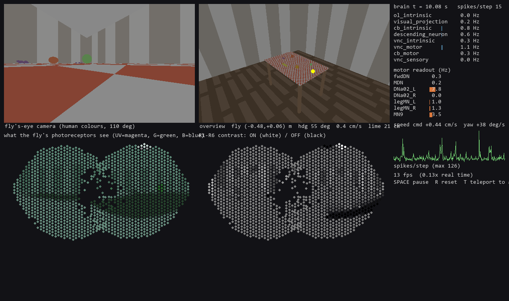

# flyverse

Simulations, games and other strange places to put the **MaleCNS v1.0** fly connectome (HHMI Janelia
FlyEM + Google Research, Sept 2026: 167k neurons, 25.6 M connections, 124 M synapses, brain **and** ventral
nerve cord). The fly gets colour vision, a body, and a room with a table with fruit on it.

```
python -m flyverse.connectome          # one-off: compile the graph cache (15 s, needs the 3 feather files)
python scripts/room_demo.py            # live pygame window: fly on the table, brain panels
python scripts/room_demo.py --headless --seconds 20 --loom-at 4 --gif out/room.gif
python scripts/probe_vision.py         # diagnostics: what responds, stage by stage ...
python scripts/probe_loom.py           #   ... a black ball rushes at the fly -> giant fibre -> escape jump
python scripts/probe_taste.py --group labellar   # sugar GRNs -> sweet interneurons -> proboscis MN9
python scripts/probe_smell.py          #   fruit odour -> ORNs -> antennal lobe (runs hot, see notes)
python scripts/probe_motion.py         #   drifting gratings: T4/T5 direction selectivity (not yet)
```

`--fast` is the speed preset for Macs / slower GPUs (`--brain-dt`, `--optic-dt`, `--cam-scale` set the parts individually).

Demo keys: SPACE pause, R reset, T teleport to the apple (taste), L loom a black ball at the fly
(escape jump), F stimulate the giant fibre directly, W stimulate the flight DNs (DNg02_a/DNa08 -> a
2-3 s powered flight), ESC quit. Scene camera: arrow keys / mouse drag orbit, +/- or wheel zoom, C
follows the fly, HOME resets. The window is resizable (the UI keeps its layout and scales to fit).
State: F5 / F9 quick-save / quick-load (`out/quicksave.pt`, ~10 MB, resumes bit-exactly), S saves a
timestamped file, `--load file` resumes from one.
Options: `--brain-map` (every soma in dorsal and lateral view, activity as highlights; sampled every
`--map-every N` drawn frames and faded in between, `--map-no-blur` to disable), `--trail-seconds`
(decaying trail of the fly in the scene view), `--start x,y[,z]` or `--start floor` (where the fly
begins; R returns there), `--window 1920x1080`. The fly has a full 3-D body frame: pitch and roll are
free in flight (nose along the flight path, banking into turns) and the fly's-eye camera and retina
follow it; on flat surfaces pitch and roll are zero.

`scripts/screen_dns.py` stimulates every descending-neuron type in its own copy of the brain (batched)
and records what the VNC does -- the model's measured motor map. It recovers known pathways: DNg02 ->
wingbeat power muscles, giant fibre -> jump muscle, DNa02 -> ipsilateral leg motor neurons, MDN -> the
backward-walking premotor set. `scripts/benchmark.py` scores any parameter set on all the behaviours.

RL / evolution on top of the brain (`flyverse/env.py`, `scripts/train_decoder.py`): `FlyRoomEnv(batch=32)`
runs 32 flies through one batched brain (1.8 ms per fly-frame on a 4090) and exposes descending-neuron
rates as observations and walking commands as actions; `train_decoder.py` evolves a linear decoder that
must find the fruit from the brain's own activity. The env follows the PufferLib vectorised convention
(PufferLib itself does not build on Windows/py3.13; see `docs/NOTES.md`). First result: 40 generations
of ES did **not** learn to approach fruit -- the notes say why and what to try next (curriculum via
`--spawn-radius`, projection-neuron observations, PPO).

Torch backend: CUDA if available, else Apple MPS, else CPU (`flyverse/device.py`; override with
`FLYVERSE_DEVICE=cpu|cuda:1|mps`). On CUDA the synaptic input is one sparse matmul over all 24.6 M
synapses; on MPS/CPU it is an event-driven gather over the outputs of the neurons that fired
(`LIFParams.event_driven`, ~1 ms per step on an M-series Mac instead of 8 ms, identical results). The
demo runs at ~0.06x real time on an M-series Mac, ~0.14x with `--fast` (brain dt 1 ms, optic-lobe dt
2 ms as in the RL env, half-resolution fly's-eye camera); the optic lobe's 8.8 M-synapse rate model is
the remaining cost there.

Data location defaults to `D:\Datasets\male-cns-connectome-v1.0\flat-connectome` (override with
`FLYVERSE_DATA`). Only three files are used: `body-annotations`, `body-neurotransmitters`,
`connectome-weights` (1.1 GB total). See `docs/NOTES.md` for everything learned about the data and the
model, and for the PufferLib note if you want to put RL on top.

## What is simulated

| stage | neurons | model | file |
|---|---|---|---|
| photoreceptors R1-R6, R7 (UV), R8 (blue/green) | 5,895 placed on 1,466 real hex columns (two eyes) | ray-traced spectral radiance [UV,B,G,R] per ommatidium -> low-pass + contrast adaptation | `retina.py`, `world.py`, `optic.py` |
| optic lobe (lamina, medulla, lobula, lobula plate) | 89,390 `ol_intrinsic` | graded rate units on the signed, input-normalised connectome (flyvis-style) | `optic.py` |
| everything else: visual projection neurons, central brain, VNC, motor neurons | 71,625 | Shiu et al. 2024 leaky integrate-and-fire (+ adaptation, synaptic depression) on the GPU | `brain.py` |
| taste | 165 labellar sugar GRNs (found by connectivity to the known sweet interneurons) | Poisson 120 Hz while touching fruit -> Usnea/Rattle/Phantom/G2N-1 -> proboscis MN9 | `scripts/find_sweet_grns.py`, `flyverse/data/taste_grns.csv` |
| smell | 2,639 ORNs in 53 glomeruli | each fruit is an odour source; ORN Poisson rates by glomerulus and distance | `olfaction.py` |
| body | walking on the table, escape jumps, flight | named readout: DNa02 L/R -> turning, DNp09/DNa01/... -> forward, MDN -> backward, leg MNs, MN9 -> proboscis; giant fibre DNp01 -> escape takeoff, DLMn/DVMn -> wingbeat thrust/lift, steering MNs (b1-3, i1-2, hg1-4 ...) -> yaw | `body.py` |

Whole thing runs at ~0.6x real time on an RTX 4090 (10 ms of brain per 16.6 ms frame; slower with the
window open). T4/T5 are direction selective (correct preferred direction for all eight subtypes, from
the wiring), a looming ball fires the giant fibre and the fly jumps, sugar on the labellum drives the
proboscis motor neurons, and rotating the fly gives a direction-flipping signal in DNp04 / LPT cells
that the body reads as an optomotor turn -- all with a few percent of the CNS active.

The motor readout is a *hypothesis* (which descending neurons mean what), not a trained decoder; the
connectome is not modified. Whether the fly walks towards the fruit is an experiment, not a promise.




*The two eyes reconstructed from the connectome: 1,466 hex columns with R1-R6 (yellow), R7 (purple),
R8 (green) and dorsal-rim (red) photoreceptors placed by their strongest lamina/medulla partner.*

## Layout

```
flyverse/connectome.py   load + compile the three feather files -> signed CSR (cached in cache/)
flyverse/retina.py       photoreceptor -> hex column -> viewing direction; spectral sensitivities
flyverse/world.py        tiny torch ray tracer: room, table, fruit, 4-channel light, textures
flyverse/optic.py        graded optic lobe + photoreceptor contrast stage + interface to the LIF
flyverse/brain.py        whole-CNS LIF (torch sparse, GPU)
flyverse/body.py         fly pose/kinematics + motor readout from named neuron groups
scripts/room_demo.py     the interactive demo
scripts/probe_vision.py  stage-by-stage diagnostic
docs/NOTES.md            findings, parameters, references, RL notes
```

Data: CC-BY 4.0, https://male-cns.janelia.org. Inspirations: stonkfly, doomfly (nftechie), fly-escape (dzhng).
