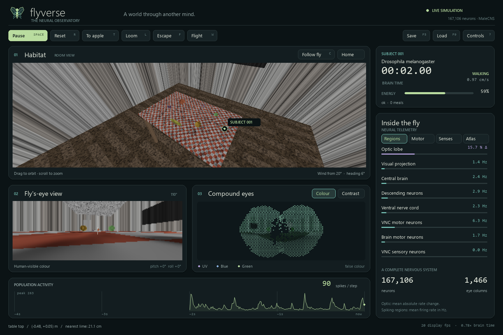
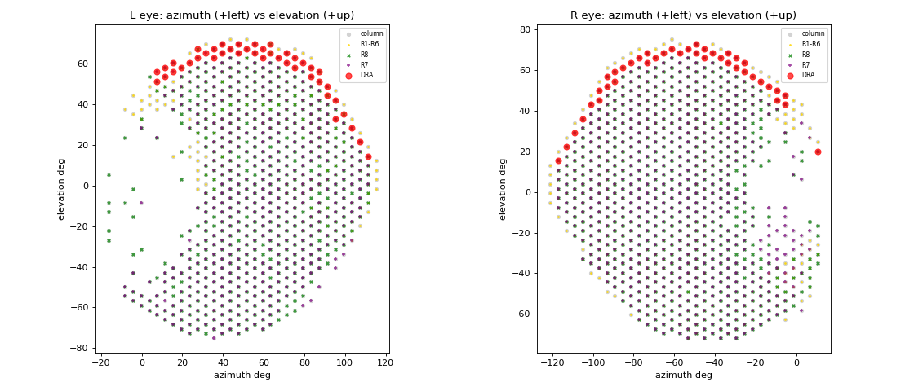

# flyverse

Simulations, games and other strange places to put the **MaleCNS v1.0** fly connectome (HHMI Janelia
FlyEM + Google Research, Sept 2026: 167k neurons, 25.6 M connections, 124 M synapses, brain **and**
ventral nerve cord). The fly gets colour vision, smell, taste, wind sense, a body that walks, jumps and
flies, and a room with a table with fruit on it. The connectome is never trained or edited; everything
the fly does comes from the wiring plus a small, documented set of physiological assumptions.


*The room console: body camera, small orbit view, both retinal mosaics, antennal inputs,
and simultaneous population, motor and body readouts. `--brain-map` opens the soma map.
[UI controls and display details](docs/ROOM_UI.md).*

## Run it

```
python -m flyverse.connectome              # one-off: compile the graph cache (15 s, needs the 3 feather files)
python scripts/room_demo.py                # live window: fly on the table
python scripts/room_demo.py --brain-map --trail-seconds 30 --window 1920x1080
python scripts/room_demo.py --start floor  # begin on the floor (it has to fly to get back up)
python scripts/room_demo.py --fruit apple --fence                  # one apple, an invisible fence around the table top
python scripts/room_demo.py --program cx --escape-gating           # simulated central-complex steering plugged into the brain
python scripts/room_demo.py --program anemotaxis --escape-gating   # the same logic as a body-level program
python scripts/room_demo.py --headless --seconds 20 --loom-at 4 --gif out/room.gif
```

Keys: `SPACE` pause · `R` reset · `T` teleport to the apple (taste) · `L` loom a black ball at the fly
(escape jump) · `F` fire the giant fibre · `W` stimulate the flight DNs (DNg02_a/DNa08: a 2-3 s powered
flight) · arrows / mouse drag orbit the scene camera, `+`/`-` or wheel zoom, `C` follow the fly, `HOME`
reset · `F5`/`F9` quick-save / quick-load, `S` timestamped save · `ESC` quit.

Speed: eager, one fly on an RTX 4090, runs at 0.5x real time (19.8 ms per 10 ms frame; the LIF matrix
no longer carries the optic lobe's synapses -- exact, 24.7M -> 13.0M nnz). `--cuda-graphs` (capture
and replay each neural frame and the sensory ray tracing) gives 0.8x; `--dt-by-module vnc=1.0`
(integrate the VNC at 1 ms, the brain at 0.5) and `--weight-dtype float16` bring it to real time
(10.4 ms); `--fast --cuda-graphs` is 1.3x. Graphs match the eager spike train for ~130 frames and
then diverge by a spike (chaos); fp16 and the coarser clock change spikes from the start, so the
probes run eager. Numbers and behavioural checks in `docs/NOTES.md`. On an M-series Mac the brain
and the ray tracer run on custom Metal kernels (`flyverse/metal.py`): 0.8x real time at full fidelity,
1.2x with `--fast` (`docs/PERFORMANCE.md`).

Options: `--brain-map` (all 140k located somata in dorsal and lateral view, activity as highlights;
`--map-every N`, `--map-no-blur`), `--trail-seconds` (decaying trail in the scene view), `--start x,y[,z]`
| `floor`, `--wind-speed`, `--wind-dir`, `--load state.pt`, `--window WxH` (the window is resizable, the
UI reflows above 1100x720 and scales below it), `--fast` (preset for Macs / slower GPUs;
`--brain-dt`, `--optic-dt`, `--cam-scale`). `?` opens the controls guide; `1`–`4` select inspector
views and `V` cycles retinal both/colour/contrast. `--screenshot out/console.png` saves the final UI.
`N` toggles the map to live NT levels; `--brain-map-mode nt` opens it at launch. This
requires an optional readout source, not NT labels; see [the NT interface](docs/NT_READOUT.md).
Save states are ~10 MB and resume bit-exactly.

For headless sweeps of the full room model, `BatchSim` runs independent environments
through one batched brain, including sensing, surface walking, flight and metabolism:

```powershell
python scripts/batch_sustain.py --batch 8 --minutes 5 --program cx --fruit apple --fence --cuda-graphs --cuda-kernels --event-driven --cuda-sparse torch --json out/batch.json
```

See [batched room simulations](docs/BATCH_SIM.md) for per-row configuration, checkpoints,
random-stream semantics and profiling. The interactive demo and RL environment keep
their existing APIs.

Data location defaults to `D:\Datasets\male-cns-connectome-v1.0\flat-connectome` (override with
`FLYVERSE_DATA`); only `body-annotations`, `body-neurotransmitters` and `connectome-weights` are used
(1.1 GB). Torch backend: CUDA, else Apple MPS, else CPU (`FLYVERSE_DEVICE`); on MPS/CPU the synaptic
input is an event-driven gather instead of the sparse matmul (`flyverse/device.py`). On MPS the gather,
the LIF update, the optic lobe's sparse products and the ray tracer are hand-written Metal kernels
compiled at first use through `torch.mps.compile_shader` (`flyverse/metal.py`; `FLYVERSE_METAL=0` for
plain torch). Spike trains match the torch path exactly; continuous state and radiance agree to ~1e-4.

## What is simulated

| stage | neurons | model | file |
|---|---|---|---|
| photoreceptors R1-R6, R7 (UV), R8 (blue / green) | 5,895 placed on 1,466 real hex columns of the two eyes | ray-traced spectral radiance [UV,B,G,R] per ommatidium, low-pass + contrast adaptation | `retina.py`, `world.py` |
| optic lobe (lamina, medulla, lobula, lobula plate) | 89,390 `ol_intrinsic` | graded rate units on the signed, input-normalised connectome (flyvis-style); T4/T5 rectify with strong delayed inhibition and are **direction selective** with the correct preferred direction for all eight subtypes | `optic.py` |
| everything else: visual projection neurons, central brain, VNC, motor neurons | 71,625 | Shiu et al. 2024 leaky integrate-and-fire on the GPU, plus adaptation, a per-connection saturation cap, a fan-in cap for giant neurons, same-type synapse damping, antennal-lobe-only depression, and two pathway gains (DN -> VNC x3, visual projection -> DN x2) | `brain.py` |
| taste | 165 labellar sugar GRNs, found by connectivity to the known sweet interneurons | Poisson while touching fruit -> Usnea / Rattle / Phantom / G2N-1 -> proboscis MN9 | `scripts/find_sweet_grns.py`, `flyverse/data/taste_grns.csv` |
| smell | 2,639 ORNs in 53 glomeruli, sided to the left / right antenna by their PN targets | every fruit is a **wind-blown plume** (Gaussian, puffing) sampled by two antennae 1 mm apart | `air.py` |
| wind | Johnston's organ C / E neurons, sided by their AMMC/WED targets | antennal deflection per side from the wind vector in the body frame | `air.py` |
| body | walking on any surface (table top, sides, underside, legs, walls, ceiling: the fly sticks to what it stands on, walks over edges and climbs corners), escape jumps, flight with pitch and roll that lands on the first surface it meets | named readout from measured groups: DNp04 + LPT27/30 (optomotor), DNp18 / DNp33 (wind direction, gated by the odour signal), DNa02 (goal steering), MDN (back up), MN9 (proboscis); giant fibre -> escape jump; DLMn / DVMn -> wingbeat; wing steering MNs -> yaw and roll | `body.py` |

Batched brains (`Brain(c, batch=64)`) run 64 flies at 1.8 ms per fly-frame -- one sparse matmul
serves them all; single-fly speed is in "Run it".

## What the connectome does, unprompted

These are measured behaviours of the wiring under the model, each with a probe script that reproduces it:

* **Direction selectivity** (`probe_motion.py`): T4a/T5a prefer front-to-back, b back-to-front, c up,
  d down, from the one-column offsets of their Mi4 / Mi9 inputs (DSI 0.16-0.26, speed-tuned).
* **Looming escape** (`probe_loom.py`): a black ball approaching at 1 m/s drives LC4 / LPLC2 -> the
  giant fibre, which spikes at ~3.5 cm range; TTMn (the jump muscle) follows it 1:1. Walking through a
  textured room leaves the giant fibre silent.
* **Sugar -> proboscis, bitter shuts it off** (`probe_taste.py`, `probe_bitter.py`): the labellar
  sweet GRNs drive the known second-order neurons (Usnea 67 Hz, Rattle 49, Phantom 47, G2N-1 28) and
  MN9; adding the bitter GRNs suppresses it. Under Shiu et al.'s uniform-synapse rules on MaleCNS:
  MN9 124 Hz on sugar, 2 Hz with bitter (they report 78 -> 3 on FlyWire); under this project's
  calibration 4.6 -> 0.
* **Wind direction** (`probe_wind.py`): the JO -> AMMC / WED -> DN pathway is the strongest lateralised
  signal in the model: DNp18 fires on the side the wind comes from (+60 Hz over its partner), DNp33 on
  the opposite side (+64), then DNge016, DNg99, DNge175, DNg05_a, DNp19 and DNpe017.
* **Rotation** (`benchmark.py`): DNp04, LPT27/30 and DNp20 flip their left-right asymmetry with the
  direction of yaw rotation -- the optomotor signal the body reads. DNa02, by contrast, takes 80% of
  its input from the central-complex steering output (PFL3 / LAL) and is read as goal steering.
* **Measured motor map** (`screen_dns.py`, every DN type stimulated in its own batched brain copy):
  DNg02 -> wing power muscles at 146 Hz with no leg drive (Namiki's wingbeat-amplitude cluster), DNa08
  and DNp31 likewise; giant fibre -> TTMn 47 Hz; DNa02_L -> ipsilateral leg motor neurons; MDN -> the
  backward-walking premotor set; DNge080 / DNge062 -> proboscis.
* **Odour code** (`probe_smell.py`): glomerulus-specific PN responses (apple: DM1 / VA2 / DM4; banana:
  DM2 / VM2), sparse Kenyon cells, MBONs at 1-4 Hz.

`scripts/benchmark.py` scores any parameter set on all of these at once (~3 min); every default in
`brain.py` / `optic.py` was chosen with it. Runs are chaotic -- repeat before trusting a 20% change.

## What we had to add to the point model, and why

Shiu et al.'s LIF with one 0.275 mV synapse per contact reproduces sugar -> proboscis but, on the whole
CNS with sensory input, it has two regimes: silent or epileptic. The notes document each finding; the
short version: neurons without a neurotransmitter prediction and monoamines are treated as non-additive
(they were the first 300 Hz loops); giant connections are capped at 60 synapse-equivalents; same-type
synapses (gap-junction-coupled populations) are damped; adaptation is 1.5 mV/spike; depression lives
only in the antennal lobe, where it is documented -- globally it blocked every descending command. The
optic lobe up to T4/T5 is graded in the animal and is a rate model here; a spiking lamina/medulla does
not propagate at all. Two pathway gains (descending -> VNC x3, visual projection -> descending x2)
stand in for per-cell-type synaptic strengths; they were the difference between motor commands that
reach the legs and ones that do not.

## Food-finding, and what is the brain's and what is not

The default model is the connectome plus a **plain body**: rates in, motion out (forward DNs ->
speed, DNa02 -> turning, the optomotor DNs -> stabilisation, MN9 -> proboscis, the giant fibre ->
jump, wing motor neurons -> flight), contact at table edges, an energy state. Nothing in that path
decides behaviour; what the fly does is what the wiring does.

Foraging by odour-gated anemotaxis -- surge upwind on an odour hit, cast when it is lost, search
when hungry -- is a **behaviour program** (`flyverse/programs.py`), an explicit, swappable stand-in
for the lateral-accessory-lobe / central-complex steering circuit, off by default and enabled with
`--program anemotaxis` (`--escape-gating` adds habituation of the escape). It reads only brain
signals the model carries -- the wind-direction DNs (DNp18 / DNp33) and the odour signal of six
lateral-horn types (`motor.LH_ODOUR_TYPES`, found by a screen: ~23 Hz next to fruit, ~5 Hz away,
whichever way the fly faces) -- and supplies the integration the model does not (yet) produce.
`scripts/probe_sustain.py` measures the fly for minutes with and without it. Where things stand
(5 min, three seeds): on the full table every configuration loses the table to an escape hop within
minutes; on a fenced table with a single apple 40 cm upwind the plain model never finds it, the body
program gets to 6 cm, the CX module feeds in 2 of 6 runs, and CX + `KlinotaxisProgram` (a sensor-side
near-field subsystem, `--program cx+klinotaxis`) in 2 of 3. The two open model questions behind
the rest -- the silent compass and the absent small-object pathway -- are mapped in the notes.

The principled replacement is a **module that plugs into the brain**: the screens (below) showed
the model's central complex is silent -- no compass, no goal comparison -- while its inputs (wind
DNs, the LH odour signal) and its output (PFL3 -> DNa02 -> legs) work. `flyverse/cx.py`
`CompassSteering` fills exactly that hole: it reads the brain's signals and drives PFL3 by
stimulation; the connectome turns the fly (`--program cx`). Nothing is injected into the body.

The tooling for finding where such functions live is `flyverse/screen.py`: record every cell type
under contrasting conditions, rank by separability with heading / wind controls, ablate or stimulate
a candidate to test it causally. `scripts/screen_odour.py` reproduces the lateral-horn result;
`scripts/screen_steering.py` asks whether any population already carries the odour x wind-side
interaction the program computes.

## RL on top of the brain

`flyverse/env.py` `FlyRoomEnv(batch=B)` is a vectorised environment (PufferLib convention; PufferLib
itself does not build on Windows/py3.13): observations are brain activity (descending-neuron rates, or
the per-glomerulus odour code), actions are walking commands, reward is progress to fruit + tasting.
`scripts/train_decoder.py` runs evolution strategies over a linear decoder. Results so far are negative
and documented: a hand-written klinotaxis policy on the odour code beats chance (93 vs 47 tasted
frames), ES did not find it in 40 generations.

## Use the brain in your own simulation

The connectome model is a control system with one small surface (`docs/CONTROL_SURFACE.md`,
`docs/ARCHITECTURE.md`): the environment supplies physical sensor values, the brain returns named
rates, the body classes (or your own) turn rates into motion.

```python
from flyverse import FlyBrain
from flyverse.body import FlyState, Locomotion

fb = FlyBrain(modules=["antennal_lobe", "mushroom_body", "gustatory", "mechanosensory", "central", "descending", "vnc"])   # modules=None: everything
fb.smell({"DM1": 0.4, "VA2": 0.2}, {"DM1": 0.2, "VA2": 0.1})   # concentration per glomerulus, left / right antenna
fb.wind(0.3, 0.3); fb.taste(0.0)                              # antennal deflection; sugar contact
fb.step(10.0)                                                 # 10 ms of brain
motor = fb.motor()                                            # MotorRates: fwd_dn, turn_L/R, wind_ipsi_L/R, lh_odour, gf, power, ...
pose, legs = FlyState(), Locomotion()
cmd = legs.readout(motor, dt_s=0.01); legs.step(pose, cmd, 0.01, bounds=(-1, 1, -1, 1))
```

`modules` picks the parts of the CNS to simulate (`flyverse/regions.py`: optic, visual_projection,
antennal_lobe, mushroom_body, gustatory, mechanosensory, central, descending, vnc); retained synapses
keep the strength they have in the full model. `FlyBrain(cuda_graphs=True)` replays captured frames,
`fb.step_budget(wall_ms)` fits the brain into a game tick and reports the time dilation, and
`flyverse.async_brain.AsyncFlyBrain` runs it on its own thread so a fixed-tick host never waits on
the GPU. `tests/` covers the surface (`python -m pytest tests -q`).

## Layout

```
flyverse/connectome.py   load + compile the three feather files -> signed CSR (cached in cache/)
flyverse/retina.py       photoreceptor -> hex column -> viewing direction; spectral sensitivities
flyverse/world.py        torch ray tracer: room, table, fruit, 4-channel light, fly-scale textures
flyverse/optic.py        graded optic lobe + photoreceptor contrast stage + interface to the LIF
flyverse/brain.py        whole-CNS LIF (torch sparse, batched)
flyverse/metal.py        Metal kernels for the MPS backend: event scatter, fused LIF update, CSR spmv, optic substep, ray tracer
flyverse/air.py          wind, plumes, bilateral olfaction, Johnston's organ wind sense
flyverse/regions.py      named brain modules, Connectome subsets, path-based paring
flyverse/fly.py          FlyBrain: the control surface (senses in, MotorRates out, step / budget / state)
flyverse/senses.py       vision / smell / wind / taste encoders onto the connectome's sensory neurons
flyverse/motor.py        named readout groups and MotorRates (incl. the lateral-horn odour signal)
flyverse/async_brain.py  the brain on its own thread / CUDA stream for fixed-tick hosts
flyverse/body.py         fly pose (3-D), walking / flight / metabolism: MotorRates -> motion, nothing decided
flyverse/surfaces.py     walkable faces: edges, corners, landings
flyverse/programs.py     hand-designed behaviour programs (anemotaxis, escape gating), opt-in stand-ins for circuits
flyverse/cx.py           CompassSteering: a simulated central-complex stage that drives PFL3 inside the brain
flyverse/screen.py       condition screens, ranking, ablation: which cells carry what
flyverse/brainmap.py     soma projections for the --brain-map panel
flyverse/room_ui.py      dense room console, controls and neural telemetry
flyverse/env.py          vectorised RL environment
scripts/room_demo.py     the interactive demo
scripts/benchmark.py     one-shot calibration harness;  scripts/probe_*.py  one behaviour each
scripts/screen_dns.py    the DN activation screen;  scripts/find_sweet_grns.py  sugar GRNs
scripts/screen_odour.py  the lateral-horn odour screen;  scripts/screen_steering.py  odour x wind steering
scripts/profile_room.py  per-frame profile of the demo loop;  scripts/profile_brain.py  the brain alone
tests/                   control-surface, world and integration tests
docs/NOTES.md            everything learned, session by session, with numbers
docs/ARCHITECTURE.md, docs/CONTROL_SURFACE.md, docs/PERFORMANCE.md   the control surface and its cost
docs/BENCHMARK_BATTERY.md   behavioural assays and how the plain model scores on each
docs/NT_INTEGRATION.md      receptor-expression data integration: findings, sources, task outline
```


*The two eyes reconstructed from the connectome: 1,466 hex columns with R1-R6 (yellow), R7 (purple),
R8 (green) and dorsal-rim (red) photoreceptors placed by their strongest lamina/medulla partner.*

Data: CC-BY 4.0, https://male-cns.janelia.org. Inspirations: stonkfly, doomfly (nftechie), fly-escape (dzhng).
