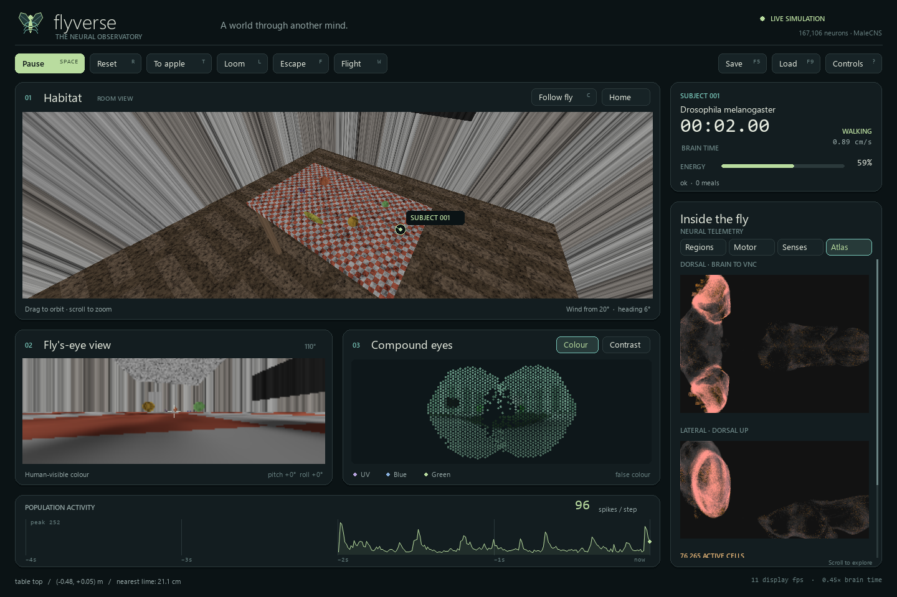

# The neural observatory

The room demo uses a dedicated pygame presentation layer in `flyverse/room_ui.py`.
Its default window is 1440x960, with a dark green palette, a line-drawn fly mark, measured
typography, and separate spaces for the habitat, body camera, compound eyes and spike history.
The right-hand inspector keeps detailed readouts accessible without overlapping the scene.


```powershell
python scripts/room_demo.py --cuda-graphs --cuda-kernels --event-driven --cuda-sparse warp --cam-scale 2
```

The backend flags are optional and retain their existing meaning. The UI also runs with
plain Torch and Metal; no new dependency or downloaded font is required. On Windows it
selects the intended Segoe UI faces explicitly because SDL sometimes aliases the family
to Segoe UI Light. Other systems use installed sans-serif and monospace fallbacks.

## Explore

The toolbar exposes pause, reset, teleport, looming stimuli, giant-fibre/flight stimulation,
save and load. Hover for a short explanation. Existing keyboard shortcuts still work.

| Control | Action |
|---|---|
| Space | Pause / resume |
| R / T | Reset the fly's pose / move next to the apple |
| L / F / W | Loom / giant fibre / flight DN stimulation |
| Drag / scroll over habitat | Orbit / zoom |
| Arrows / + / − | Orbit / zoom with the keyboard |
| C / Home | Follow the fly / restore the overview camera |
| 1 / 2 / 3 / 4 | Regions / Motor / Senses / Atlas |
| V | Retinal false colour / R1–R6 contrast |
| F5 / F9 / S | Quick-save / quick-load / timestamped save |
| ? or H | Controls guide; pauses and restores the previous playback state when closed |
| Escape | Close the guide, or exit when it is closed |

Scroll inside the inspector to reach every row. **Regions** shows mean firing rates in Hz;
the graded optic lobe instead shows mean absolute change from its operating point as a
percentage of its unit rate range. **Motor** includes locomotor and flight readouts plus
body commands. **Senses** shows contact, wind direction, and bilateral antennal odor
concentrations sorted by strength. **Atlas** lazily loads soma positions and shows dorsal
and lateral activity, followed by the most active cell types. `--brain-map` opens Atlas
at startup; it no longer adds a separate column to the window.



The body camera is a display in human-visible colour. Compound-eye colour uses the actual
four-band sensory radiance, with UV mapped to magenta, blue to blue and green to green.
Contrast is shown separately, with OFF dark and ON light. The spike chart contains the
last LIF step sampled every 10 ms frame, over a four-second window.

## Window, captures and timing

The layout uses the available window size at native resolution above 1100x760. Smaller
windows scale the minimum canvas uniformly; pointer hit testing uses that same transform.
Text has explicit width budgets, and telemetry clips to its own scrolling viewport.
The closer initial orbit and camera pixel sizes affect only the display, not sensory
sampling or neural/body parameters.

Paused eye images and the static room background are cached. Camera/geometry changes
refresh the room image, including the moving loom. Atlas fading advances with simulation
frames, so a paused brain does not fade just because the UI redraws. The guide consumes
input, and save/load actions give visible success or error feedback.

```powershell
python scripts/room_demo.py --headless --seconds 2 --screenshot out/observatory.png
python scripts/room_demo.py --brain-map --window 1920x1080
python scripts/room_demo.py --headless --seconds 2 --gif out/observatory.gif
```

Screenshots save the final canvas; GIF frames retain their initial dimensions even if the
window is resized during recording. Headless mode still renders the UI. `profile_room.py`
continues to wrap the real demo's `draw` function. UI timings from the older 1280x760
prototype are not directly comparable to the new layout and cameras.

Validation uses the real pygame event loop with deterministic display data to check
resized click targets, telemetry scrolling, keyboard/button equivalence, modal playback,
save/load dispatch, redraw caching, and paused atlas stability. Real connectome renders
were inspected at 1100x760, 1440x960 and 1920x1080, along with a live Windows run.
The CUDA and full-connectome checks passed (42 tests including the UI checks; 11 Metal
checks skipped on Windows). Two existing pose-comparison assertions were updated for
the array-valued surface pose, preserving exact equality for every field. A headless
brain-map run also produced a 25-frame, 1440x960 GIF and a final PNG successfully.
The existing room profiler completed its smoke run with drawing, presentation and
CUDA frame timing intact. This was a compatibility check, not a throughput benchmark
on the shared machine.
