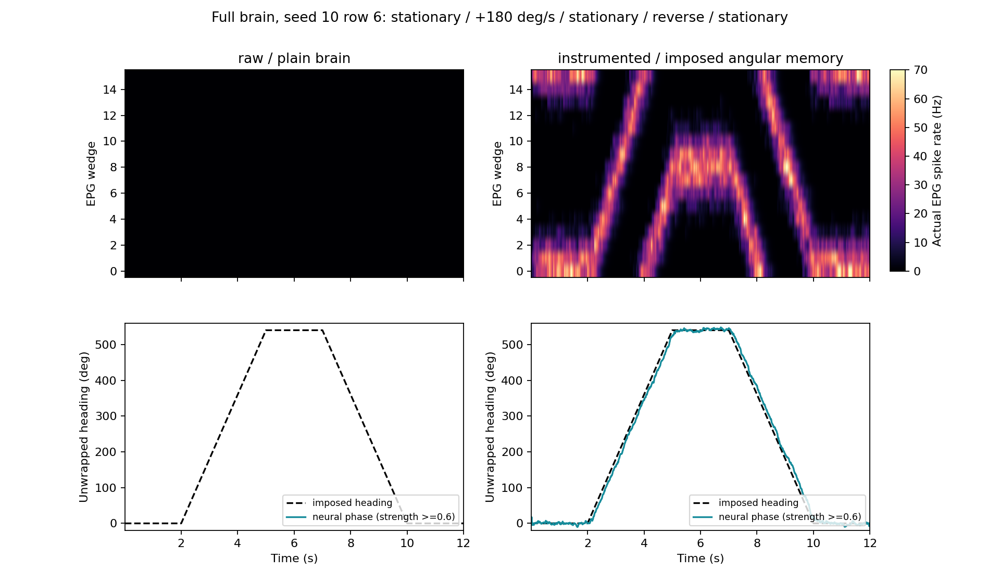

# Compass stand-in: imposed angular memory

Work started 2026-09-15 at the owner's request after round 7. This is a program-controlled EPG
input, explicitly under `instrumented`, while `raw` keeps the plain brain. The owner permits this
route and permits a future room-demo default; this branch keeps the default raw pending validation.

## Answer

The explicit `compass` instrument supplies a usable imposed heading representation: all 48 trajectories
(six neural seeds, eight rows per run) pass the frozen turn, reversal and stationary-memory engineering
checks. Stationary phase error p95 is 5.45-8.50 degrees; moving error p95 is 8.41-23.51 degrees, including
the existing rate-estimator lag. The angular memory lives in the program. The biological compass
mechanism remains unresolved, and there is no demonstrated food-finding or steering improvement.

Native CUDA adds 54.22 microseconds per 10 ms brain frame at B=1 (11.01%), 3.19% at B=8 and 1.22% at
B=32 in the final paired profile. B=1 **misses** the declared <=10% target. Capture removes the remaining
module launch overhead and the traces confirm zero scalar readbacks in steady frames. These are
shared-device, brain-only measurements; the B=6 native room pair is 12.84/13.18 ms per frame and the UI
has only a visual smoke check. All modules and biological neurons remain present.

The stand-in remains **experimental and opt-in**. The three-draw suite has no passing-row regression,
but one taste row changes FAIL to PASS, which **fails** PRESETS_SPEC's stricter no-status-change rule.
The 300 s room rate-half is not run, and GPU room trajectories are not exactly reproducible even
between two runs of the same eager code. Raw remains the default; no physiological constant, receptor,
synapse or cache changes. Final CPU: 482 passed / 19 skipped / 220 subtests; original golden unchanged.
Final house fixture: 15 exact lifecycle checks; existing CUDA tests: 8 passed / 2 skipped / 3 subtests.
**Independent skeptic pass (Opus, 2026-09-17): mostly sound** -- the claims match the code and no unearned
physiology was found; the pass is quoted at the end of this audit.

## Source reading and interpretation

Wang's repository was read at commit `80b94e6608cf927ca2c9f2bbce0577c5a998684c`, including the
requested [findings index](https://pwang724.github.io/fly-circuit-exploration/findings/index.html),
[compass recurrence](https://github.com/pwang724/fly-circuit-exploration/blob/80b94e6608cf927ca2c9f2bbce0577c5a998684c/docs/compass-recurrence.md),
the September 13 audit and the corrected finding-4 page. Its minimal simulator was inspected as
source, not imported or copied. The interpretation used here is deliberately narrower than the
site's headline: a naive rate model can stall when write-position feedback is added at count-based
strength; its updated page also notes that fitted models integrate with these contacts present.
Anatomical counts do not identify the effective gains or prove which biological correction is needed.
The released flat MaleCNS graph cannot separate these contacts by neuropil.

The interleaved EPG wedge order is L1,R8,L2,R7,...,L8,R1, parsed from the released instances and
checked in the previous local compass audits. Only the 46 EPG cells are targeted. Missing labels
or incomplete rings fail explicitly; this is not silently transplanted to another dataset.
[Turner-Evans et al. 2017](https://elifesciences.org/articles/23496) supplies the functional motivation
of maintaining heading and integrating angular velocity. The exact law and constants below are
**unverified engineering choices**, not extracted physiological parameters or an implementation of
Wang's fitted circuit. No claim about ExR6/Delta7 receptors, GLNO's sign, or PEN gain follows from it.

## Implementation contract

`CompassDriver` is an ordinary attached module and named instrument. It holds one phase and one
angular-velocity input per batch row, integrating `phase += yaw_rate * dt` modulo 2*pi. It supplies
`50*exp(-0.5*(wrapped_angle_error/radians(35))**2)` Poisson Hz to each EPG. Initial phase is arbitrary;
positive yaw advances the declared wedge coordinate. The body supplies realized yaw velocity through
the existing `proprioception` entry point. There is no world-heading, fruit-position or goal oracle.
No neuron voltage, rate, receptor, weight or body command is overwritten. Parent neurons still emit
spikes, communicate through the unchanged graph and determine the motor readout.

The continuous drive supplies BOTH angular memory and its neural representation. It is not a small
repair of a discovered natural mechanism, and it is not an attractor in the connectome. It has no
visual cue anchoring, tilt compensation, destination memory or steering policy. Phase follows the
held velocity input until it is updated; reset clears velocity and phase. Checkpoints include both,
partial batch reset affects only selected rows, and detach removes the instrument and its inputs.

Work is O(B*n_EPG) per frame: one batched tensor profile, no neural readback and no per-cell Python
loop. The existing extension scheduler and core CUDA graphs are retained. Their actual overhead is
measured separately; a small formula alone does not establish low integration overhead.

CPU development checks before the house declaration: 11 focused/golden tests and 10 subtests passed;
49 existing integration tests and 200 subtests passed, 4 skipped. A 1 s full-brain CPU smoke gave a
clear stationary bump. A seed-0, B=1, 12 s turn pilot at -180 deg/s gave mean vector strength 0.815,
stationary error p95 5.72 deg and moving error p95 24.41 deg. The Poisson law was not changed after
these observations. The legacy motion/loom benchmark smoke passed all four checks with the real
instrument scheduler active. These are development observations; house contract seeds 10-15 are fresh.

## House declaration (before submission)

`scripts/compass_driver_batch.py` freezes commands, parameters, source hashes and the criteria below.
The batch is engineering validation, not a hypothesis test about the animal. No gain fitting, model
default adoption or mechanistic receptor inference is licensed by a pass.

1. Functional contract: raw and instrumented, seeds 10-15, each B=8, full brain, default LIF/receptors,
   no optic input or edge holds, 12 s. Angular speeds -180,-90,-45,0,45,90,180,90 deg/s, held at zero
   for [0,2), forward on [2,5), zero [5,7), reversed [7,10), zero [10,12). Last row starts at 90 deg;
   others at zero. Readout averages cells within each wedge first, then computes the circular moment.
   Ignore the first 0.5 s; omit the first 0.5 s after turn cessation for stationary error. Each driven
   run/row must have mean vector strength >=0.7, fraction below 0.6 <=0.05, stationary error p95 <=15 deg,
   moving error p95 <=max(22.5, 0.1*abs(speed)+15) deg, and each sustained-turn slope within
   max(5, 0.15*abs(speed)) deg/s of the imposed speed (opposite on reversal). The error allowance
   explicitly includes the existing 100 ms rate-estimator lag. No eligibility-based dropping of rows.
   Bump rate/width are descriptive; these criteria are not the prior physiological compass ledger.
2. Legacy benchmark: three draws per preset, seeds 0,1,2, full `all` sections with matched seed
   overrides. Every legacy direct-Brain probe uses `InstrumentedBenchmarkBrain` to run the actual
   FlyBrain extension scheduler; room probes receive the same preset/instrument. Controller provenance
   is saved. No previously passing benchmark row may worsen for admission; otherwise keep the driver
   experimental and name the failures. The earlier handoff's `benchmark_suite.py` filename does not
   exist; the real script is `scripts/benchmark.py`.
3. Room observation: two matched B=6 batches, environment seeds 10-15, neural seed 10, fenced apple
   room, 60 s, no body program. Record movement, yaw, hops, EPG activity and frame timing. This short
   engineering run cannot establish food finding or replace the 300 s adoption rate-half. No default
   change is made on its strength.
4. Performance: B=1,8,32, four alternating repeats of 100 frames per preset after 50 warmup frames.
   Both receive the same tonic EPG forcing, so differences in Poisson activation do not confound
   scheduler overhead. Report synchronized wall and CUDA event time, plus module-only time. Shared
   hardware timings are observations, not idle-device guarantees. Target: <=10% median frame overhead;
   if missed, optimize the scheduler or clearly record the limitation before calling the route fast.
5. UI smoke: headless room with `--preset instrumented --instrument compass --brain-map`, save a frame.
   The console must name the preset/instrument and the existing map must display actual neural rates.

## Results

The immutable declaration and all generated records stay under `out/compass_standin/`.
The chronological declarations below retain failed attempts; the completed findings follow them.

### Scheduler correction declaration (before the second submission)

The first paired profile missed the <=10% target: median synchronized frame overhead was
91.80%, 85.44%, 16.76% at B=1,8,32; the formula alone cost 114.76,119.48,132.87 CUDA microseconds.
The shared-device timings are noisy, but they do not support calling the first scheduler integration fast.
Two explicit host waits sit in the module path: finite-output checking and reduction of Poisson activity.
The body's yaw upload also used a blocking copy. No gain or dynamical law is changed in the correction.

`out/compass_standin_r2/` freezes the following correction tests before running them:

- The compass opts into an asynchronous CUDA invariant assertion. Its ordinary user inputs (shape,
  finite yaw and representable gain/width, 0-10 ms frame, checkpoint shape/range) are still validated.
  A nonfinite internal CUDA output is a bug and may abort the CUDA context on a later launch; other
  modules keep synchronous error checking. The known positive Gaussian lower bound, including dt,
  avoids reading back whether Poisson forcing is active. The proof is used only after a full output,
  cleared on any reset/load/detach, and unavailable for a narrow profile whose bound underflows.
  Host yaw copies are nonblocking; fields retain clone ownership, but stop allocating an unused zero tensor.
- Rerun all six instrumented contract seeds with unchanged parameters. Require **every saved array
  to equal the first submission exactly**, then apply its original engineering gates without changes.
- Repeat the 60 s, B=6 instrumented room with the original backend and require identical saved body
  and EPG trajectories and hop counts. CPU tests also cover matched raw/compass forcing and all-row
  partial resets. A house EPG-subgraph fixture compares the asynchronous and original checked paths
  through pulse expiry, partial reset, checkpoint replay and detach, every brain tensor exactly.
- Repeat the original paired profile, and add a paired native-CUDA profile (CUDA kernels, event driven,
  graphs, warp sparse at B=1 and torch CSR in batches). Four alternating repeats, B=1,8,32, same <=10%
  median overhead target. Matched-input final brain tensors must agree exactly. Native room arms at
  B=6, 60 s add actual body/sensory timing; they remain observations, not the 300 s admission rate-half.

The first submission stays intact. Its full benchmark pairs are still running at this declaration;
no suite outcome or compass gain has been used to select the scheduler correction.

### Capture declaration (before the third submission)

The second submission completed 11/11 jobs. All six instrumented turn traces reproduce every first-batch
NPZ array exactly, and the nine small-graph CUDA lifecycle checks pass. Its **room replay is not exact**.
The matched-input profile also fails exact equality on voltage/conductance, and on additional spike-state
tensors at native B=32. These failed gates are retained, not rounded away. The room repeat control below
will test whether this is specific to the scheduler change; no numerical tolerance is chosen from them.

Native median frame timings (raw/instrumented) are 0.5776/0.9371, 3.0920/3.4978,
12.7838/13.1810 ms at B=1,8,32. The native B=1 and B=8 <=10% targets still fail. The plain Torch
profile is visibly affected by changing contention (B=8 raw repeat times 185.6,185.6,173.7,23.3 ms).
The remaining small-batch cost motivates capturing the explicit, read-free compass module together with
the existing neural frame. This does not fuse or change its arithmetic or gains. Timed pulses, hooks and
general modules retain the eager scheduler; cache replay must restore the correct module input buffers.

`out/compass_standin_r3/` freezes **one sequential house job**, after this experiment's other jobs end:

- Extended CUDA lifecycle fixture: compare captured and checked paths, including returning from a timed
  pulse, new external drive, different frame lengths, module-input snapshots, partial reset and checkpoint.
  Also run the existing opt-in CUDA test file. Any error stops the job before performance claims.
- Native paired profiles with and without module capture, same B=1,8,32 and four alternating repeats;
  target remains <=10%. Use an external held 50 Hz setter in both arms instead of an unexpired 100 s
  pulse, because a live timed pulse deliberately disables module capture. The represented forcing is
  identical throughout the 4.5 s profile. Record per-tensor maximum differences as well as exact equality.
- CPU/CUDA traces for raw, synchronous-check control, eager-module and captured-module frames. Verify
  actual module capture and count scalar readbacks; all modes receive the same tonic input. The check
  control also uses the original blocking yaw upload. This identifies work independently of wall time.
- Repeat all six fixed turn seeds under capture and report every original functional gate and array
  equality result. No parameter is fitted and no failed row is dropped.
- Two **same-code eager** 60 s B=6 instrumented rooms, then a captured room, same neural/environment
  seeds and no program. Report exactness, maximum differences and first divergence for the repeat and
  capture comparisons. Repeat native raw/instrumented rooms for actual integrated timing. These are
  reproducibility/timing controls, not additional draws for an adoption or food-finding claim.

The initial suite has 87 paired check rows with no passing-row regression, but a taste row changes
FAIL to PASS. That passes the initial declaration's narrower screen but **fails PRESETS_SPEC's stricter
no-status-change-outside-the-gap rule**. This is an author self-review correction of the acceptance
interpretation, not a retroactive change to data or thresholds. The driver remains experimental and
the raw default remains unchanged regardless of the timing outcome.

Capture attempt r3 stopped at the **first** CUDA fixture: the module scheduler uploaded its resolved
CPU target indices inside capture. No profile or trajectory from that attempt is used. Caching these
fixed read/write index tensors at attachment fixes both the unsupported transfer and a previously
missed per-frame host synchronization. This is an input-binding optimization; the cell selections and
math are unchanged. The identical sequential declaration is retried under `out/compass_standin_r4/`.
The wrapper now uses `&& tail`, because the nested launch path reported r3 as completed despite the
Python error. Artifact and console checks caught it; a scheduler completion label is not validation.

Attempt r4 also stopped in the first fixture, now with an illegal-address error. The captured ownership
clone read a warmup input tensor whose storage was not retained after capture. The graph cache now
retains that external input storage alongside its output bindings. The retry is `out/compass_standin_r5/`,
with the same scientific/engineering commands and thresholds. The correctness fixture synchronizes each
controller separately to identify any device error at its source. Neither failed capture attempt has
timing or behavioural results, and neither is counted as passing validation.

The successful r5 run is followed by a focused storage-lifetime precaution, frozen under
`out/compass_standin_r6/` before submission. Warmup input tensors are recorded on the replay stream,
so an immediate reset/detach cannot return their side-stream allocation to the allocator while a
replay still uses it. The fixture adds queued, unsynchronized replay followed by reset and detach;
the existing CUDA tests and native profile are repeated. This changes storage bookkeeping, not
the law or gains. It supplies no new science draws and does not replace r5's room/turn records.


## Completed findings

### Functional heading memory

All 48 driven rows pass every predeclared engineering gate. These are six seeded runs with eight
batched trajectories each, not 48 independent experiments; no inferential p-value is claimed. Mean
vector strength ranges 0.8088-0.8333, the fraction below 0.6 is zero in every row, mean peak rate is
49.10-55.26 Hz, and mean width is 3.261-3.662 wedges. The stationary and moving error ranges in the
Answer are per-trajectory p95s, not pooled errors. The six raw no-input runs have zero recorded EPG
rates, so their neural phase is undefined and their phase errors cannot be read as a compass result.

The r2 scheduler and r5 captured reruns reproduce **every saved NPZ array** of each initial driven run
exactly. The final r6 change only records allocation lifetime and passes the expanded GPU lifecycle
fixture; it does not add new turn draws. The numerical source of every row is
`out/compass_standin/analysis/contract_rows.csv`; r5's independent recomputation is
`out/compass_standin_r5/analysis/contract_rows.csv`. The list below is pasted verbatim from
`out/compass_standin/analysis/per_seed_lists.txt`; batch speeds are [-180,-90,-45,0,45,90,180,90] deg/s,
and only the last row starts at 90 degrees. Empty failed-gate strings mean pass, not missing data.



The plot is seed 10, row 6, selected as the declared +180 deg/s example, not by outcome. The dashed
line is the imposed heading; the colored line is decoded from parent-neuron spike rates. A visible
bump does not establish that the parent circuit supplies the angular memory.

```text
Ordered by seed 10..15, then batch row 0..7. No sorting by outcome or dropping rows.
Source: contract_rows.csv; instrumented rows; one list per run. Rows share a brain RNG stream.
seed 10:
  mean_strength: [0.811, 0.8281, 0.832, 0.8313, 0.8303, 0.8298, 0.8132, 0.8254]
  weak_fraction: [0.0, 0.0, 0.0, 0.0, 0.0, 0.0, 0.0, 0.0]
  stationary_error_p95_deg: [6.5888, 7.1043, 6.3396, 6.1921, 6.7861, 6.0081, 6.4267, 6.6906]
  moving_error_p95_deg: [23.27, 14.0329, 9.0276, null, 12.4396, 16.5533, 23.5093, 15.0198]
  first_slope_deg_s: [-178.8628, -91.7409, -45.0715, -0.5537, 43.9549, 90.3544, 179.7674, 90.0133]
  reverse_slope_deg_s: [180.3296, 92.565, 43.7943, -0.1878, -46.8134, -89.1175, -180.2209, -92.4244]
  mean_peak_hz: [49.5977, 51.931, 51.6662, 53.66, 53.0685, 53.2356, 51.5364, 53.6126]
  mean_width_wedges: [3.5143, 3.4361, 3.4813, 3.3649, 3.5456, 3.417, 3.5352, 3.4579]
  failed_gates: ["", "", "", "", "", "", "", ""]
seed 11:
  mean_strength: [0.8102, 0.8333, 0.8253, 0.8307, 0.8294, 0.8264, 0.8102, 0.8256]
  weak_fraction: [0.0, 0.0, 0.0, 0.0, 0.0, 0.0, 0.0, 0.0]
  stationary_error_p95_deg: [5.5229, 7.1737, 6.3304, 7.1498, 6.8387, 6.9965, 6.4217, 5.6998]
  moving_error_p95_deg: [22.8104, 14.0774, 10.6771, null, 8.4106, 13.4819, 22.7429, 12.9599]
  first_slope_deg_s: [-179.3353, -90.3218, -45.0603, -1.1724, 42.9592, 90.6358, 181.0153, 89.974]
  reverse_slope_deg_s: [178.8309, 88.6294, 45.9915, 1.4794, -46.3325, -90.5379, -180.9214, -88.9693]
  mean_peak_hz: [49.0997, 52.8697, 52.1973, 52.7732, 52.747, 52.4998, 51.6674, 52.9394]
  mean_width_wedges: [3.662, 3.437, 3.3988, 3.4474, 3.4379, 3.543, 3.5699, 3.4466]
  failed_gates: ["", "", "", "", "", "", "", ""]
seed 12:
  mean_strength: [0.8128, 0.8265, 0.8312, 0.8321, 0.8332, 0.8225, 0.8151, 0.8223]
  weak_fraction: [0.0, 0.0, 0.0, 0.0, 0.0, 0.0, 0.0, 0.0]
  stationary_error_p95_deg: [7.666, 6.4739, 7.9007, 6.7088, 8.5043, 6.5895, 5.8978, 6.9911]
  moving_error_p95_deg: [22.1742, 13.4361, 8.6838, null, 9.7396, 12.6696, 22.9182, 14.4426]
  first_slope_deg_s: [-180.6931, -91.2106, -45.2609, 2.674, 47.3377, 90.5776, 179.1532, 89.9645]
  reverse_slope_deg_s: [178.7241, 91.4856, 44.6975, -2.4992, -46.9913, -90.5763, -178.1181, -90.7465]
  mean_peak_hz: [51.5295, 50.7447, 55.2588, 53.1299, 52.8115, 52.5727, 50.7494, 51.9134]
  mean_width_wedges: [3.5647, 3.5821, 3.2806, 3.5161, 3.3423, 3.5274, 3.5083, 3.4857]
  failed_gates: ["", "", "", "", "", "", "", ""]
seed 13:
  mean_strength: [0.815, 0.825, 0.8312, 0.8317, 0.8313, 0.8286, 0.8147, 0.8215]
  weak_fraction: [0.0, 0.0, 0.0, 0.0, 0.0, 0.0, 0.0, 0.0]
  stationary_error_p95_deg: [7.5915, 6.7115, 6.3666, 6.7815, 6.4763, 6.4862, 7.3323, 6.4705]
  moving_error_p95_deg: [22.7229, 13.0082, 11.0807, null, 9.2488, 15.3473, 22.0746, 12.635]
  first_slope_deg_s: [-178.6791, -88.9745, -43.6383, 0.0126, 45.2221, 90.7471, 179.2575, 89.5113]
  reverse_slope_deg_s: [178.7189, 88.9742, 47.5469, -0.4004, -45.1739, -88.6679, -180.872, -89.9499]
  mean_peak_hz: [50.395, 54.0029, 54.0849, 52.3407, 52.9576, 52.4702, 51.5955, 52.4345]
  mean_width_wedges: [3.5404, 3.3675, 3.4083, 3.5022, 3.4483, 3.4188, 3.5395, 3.53]
  failed_gates: ["", "", "", "", "", "", "", ""]
seed 14:
  mean_strength: [0.8088, 0.8285, 0.8237, 0.8299, 0.8261, 0.827, 0.813, 0.8263]
  weak_fraction: [0.0, 0.0, 0.0, 0.0, 0.0, 0.0, 0.0, 0.0]
  stationary_error_p95_deg: [6.7306, 6.5631, 7.4067, 6.9844, 7.0399, 6.5245, 6.5258, 6.7589]
  moving_error_p95_deg: [22.1797, 13.7981, 10.2318, null, 10.0393, 14.0108, 22.2363, 14.5192]
  first_slope_deg_s: [-180.1027, -88.1554, -43.1767, -0.4654, 45.9511, 89.3919, 181.0591, 88.2267]
  reverse_slope_deg_s: [178.6049, 89.2929, 46.4944, 0.167, -42.8627, -88.8775, -181.1463, -88.5937]
  mean_peak_hz: [50.729, 52.5233, 53.4053, 52.4695, 51.5052, 52.869, 49.8475, 52.2399]
  mean_width_wedges: [3.6507, 3.4222, 3.4361, 3.397, 3.4335, 3.2606, 3.5856, 3.4961]
  failed_gates: ["", "", "", "", "", "", "", ""]
seed 15:
  mean_strength: [0.8121, 0.8275, 0.8278, 0.8304, 0.8311, 0.8231, 0.8141, 0.8292]
  weak_fraction: [0.0, 0.0, 0.0, 0.0, 0.0, 0.0, 0.0, 0.0]
  stationary_error_p95_deg: [7.8795, 7.056, 6.8016, 7.385, 6.6131, 5.4453, 6.0602, 5.6176]
  moving_error_p95_deg: [22.4406, 11.7672, 9.7613, null, 8.7929, 13.7891, 21.1701, 13.3867]
  first_slope_deg_s: [-179.6961, -89.3801, -45.3081, -1.2479, 44.1896, 89.1488, 180.8426, 88.3774]
  reverse_slope_deg_s: [180.415, 90.4799, 43.7796, 0.5408, -45.0275, -89.8583, -182.0856, -88.9144]
  mean_peak_hz: [51.1026, 50.8486, 52.4704, 52.5073, 52.7695, 52.2985, 51.2221, 53.2042]
  mean_width_wedges: [3.5482, 3.5091, 3.4726, 3.5126, 3.4509, 3.4891, 3.5891, 3.3475]
  failed_gates: ["", "", "", "", "", "", "", ""]
```

### Suite and room admission

The original implementation (`497589d`) runs all 29 checks at each of seeds 0,1,2 under each preset:
87 paired rows, with controller provenance for the real module scheduler. Raw tallies are 27/0/2,
26/1/2 and 27/0/2 (PASS/FAIL/KNOWN GAP); instrumented is 27/0/2 at all three seeds. The one status
change is `taste.MN9_hz`, seed 1: 1.690456 to 4.295961 Hz, FAIL to PASS. This fails strict admission
regardless of its favorable direction. Quantitative side effects also matter: seed 0 taste is
10.934177 to 2.478648 Hz while retaining PASS. The gap was declared as heading memory, not taste.
The no-regression screen in the initial declaration was too weak; its correction is explicit above.

The legacy compass check remains KNOWN GAP: it tests persistence at an externally pulsed wedge,
whereas this driver represents its own arbitrary integrated phase and does not adopt a pulse's
position. Its instrumented persisting-cell counts are [0,0,1], versus raw [0,0,0]. LC10a also remains
KNOWN GAP. The complete paired values follow below; no row is omitted because it is inconvenient.
The suite was not rerun after the scheduling optimizations. Exact controlled turn traces and the
lifecycle fixture support that narrower equivalence claim; they do not establish whole-suite GPU
bit-identity, and no admission claim depends on it.

All room runs use `program='none'`. The initial two 60 s B=6 arms and the r5 reproducibility/native
controls are observations, not the 300 s admission rate-half. Sampled path length is not approach
to fruit. The runs do not establish food finding or spontaneous-turning recovery. EPG mean rates
near 11.5 Hz in the instrumented rooms establish engagement of the imposed input only.

### Performance and exactness

Final native-CUDA profile, `out/compass_standin_r6/profile_native.json`, on the house B200. Every frame
represents 10 ms; raw and instrumented receive the same held tonic EPG forcing. B=1 uses warp sparse,
B=8/32 Torch CSR; all use native kernels, event-driven updates and graphs. The timing table is the
median of four alternating 100-frame repeats after 50 warmup frames, with GPU synchronization at
repeat boundaries. No idle-device guarantee or UI frame-rate claim follows from it.

| batch | raw ms/frame | instrumented ms/frame | added us/frame | overhead | <=10% target |
|---|---:|---:|---:|---:|---|
| 1 | 0.492339 | 0.546556 | 54.22 | 11.01% | FAIL |
| 8 | 3.000885 | 3.096711 | 95.83 | 3.19% | PASS |
| 32 | 12.692891 | 12.847631 | 154.74 | 1.22% | PASS |

The preceding r5 capture profile gives 10.97%,3.17%,1.19%; its same-code eager-module profile gives
24.47%,6.09%,1.61%. Retaining the final lifetime precaution costs essentially the same measured time;
we did not tune the law to cross the 10% boundary. The separately launched module formula is
78.33/91.06/78.98 us in r6; it includes its own launch overhead and is not an additive component of
the captured frame. Earlier contended measurements and failures are preserved above.

The r5 CPU/CUDA traces cover 20 steady frames per mode with the same tonic drive and zero-yaw update.
`aten::_local_scalar_dense` counts are raw 0, checked control 40, eager module 0, captured module 0.
Only the captured mode has a module graph (one). The checked control deliberately restores the
synchronous invariant/activity checks and blocking yaw upload. Cached target indices remove an
additional transfer that the first optimization missed. Chrome traces remain under
`out/compass_standin_r5/trace/`; the script is `scripts/compass_driver_trace.py`.

Native B=6 room median frame times are 12.8386 ms raw and 13.1783 ms instrumented (+2.65%); p95s are
13.0708/13.4177 ms. Plain-Torch eager repeats are 27.1003/27.1580 ms, captured 26.8405 ms. These
include body/sensory work and the script's recording overhead, but no renderer. Different trajectories
also change neural work, so this is not a pure scheduler comparison. The UI smoke with `--brain-map`
shows the preset/instrument and real neural rates (`out/compass_standin/ui.png`); UI performance remains
unmeasured. No claim of a 2.65% UI cost is made.

Exact equality has deliberately narrow scope. r5's 13 small-graph lifecycle checks pass, and r6 adds
queued replay followed by full reset and detach for 15 checks. The existing CUDA file passes 8 tests,
2 skipped, 3 subtests in both runs. In the final matched-input **full-brain** profile, voltage and
conductance still differ by at most 3.05176e-5; the other recorded state tensors, including rates and
spikes, agree exactly. The earlier r5 B=32 capture pair additionally differs by one in a spike-count
cell and has rate difference 9.36678 Hz and conductance difference 26.6499. These equality gates
**fail**; the later cleaner draw does not erase the earlier failure. Floating accumulation differences
crossing a threshold are a plausible explanation, not established causation from this experiment.

The r5 same-code eager room pair first differs in saved body state at index [9,3,0] (1.0 s, row 3, x)
and EPG rate at [12,3,33] (1.3 s). Eager versus captured first differs at those same indices. Maximum
EPG differences over 60 s are 71.03597 and 70.85271 Hz respectively. Body columns mix meters, radians,
speeds and a boolean, so their combined maximum in the JSON is not a meaningful physical distance.
The same-code repeat demonstrates that room divergence is not specific to introducing capture; it
does not prove statistical equivalence or excuse the failed exactness gate. This is consistent with
the previously documented GPU reproducibility limit, not a new guarantee.

### Complete paired tables

### Suite values by draw

Source: `out/compass_standin/analysis/suite_rows.csv`, columns `raw_value` and `instrumented_value`.
Each list is ordered by draw seed [0,1,2], unsorted by outcome. P=PASS, F=FAIL, G=KNOWN GAP.

| check | raw [0,1,2] | instrumented [0,1,2] | raw / instrumented status |
|---|---|---|---|
| rest.spikes_per_step | [0, 0, 0] | [3, 0, 0] | PPP / PPP |
| taste.MN9_hz | [10.9342, 1.69046, 3.12959] | [2.47865, 4.29596, 9.27711] | PFP / PPP |
| smell.PN_hz | [7.86116, 11.1984, 11.6049] | [9.35426, 6.60227, 2.98635] | PPP / PPP |
| smell.KC_active | [816, 1345, 1518] | [1190, 1202, 532] | PPP / PPP |
| dn.DNa02_L_leg_asym_hz | [2.58063, 2.40017, 2.38502] | [2.58063, 2.40017, 2.2464] | PPP / PPP |
| dn.MDN_top_hz | [153, 172, 182] | [149, 168, 188] | PPP / PPP |
| dn.DNp09_top_hz | [152, 157, 122] | [172, 157, 122] | PPP / PPP |
| walk.GF_max_hz | [4.62916, 4.96265, 4.60406] | [9.85212, 5.35751, 9.06606] | PPP / PPP |
| walk.power_max_hz | [48.4805, 53.5587, 56.1464] | [63.2179, 69.1525, 54.2596] | PPP / PPP |
| walk.power_sustained_hz | [20.1091, 27.893, 25.5384] | [29.9417, 36.543, 26.2494] | PPP / PPP |
| loom.GF_peak_hz | [47.1993, 51.4268, 52.8799] | [44.4985, 45.4109, 50.9155] | PPP / PPP |
| loom.escape_cm | [3.5, 3.5, 3.5] | [3.5, 3.5, 3.5] | PPP / PPP |
| rotate.DNp20_flip_hz | [-38.1083, -29.9594, -29.4401] | [-38.6436, -34.1511, -36.9592] | PPP / PPP |
| motion.min_dsi | [0.241097, 0.241097, 0.241097] | [0.251814, 0.240121, 0.244777] | PPP / PPP |
| motion.correct_directions | [8, 8, 8] | [8, 8, 8] | PPP / PPP |
| loom_escape.GF_peak_hz | [43.0381, 43.4018, 44.4386] | [44.3698, 45.9057, 45.8361] | PPP / PPP |
| loom_escape.escapes | [1, 1, 1] | [1, 1, 1] | PPP / PPP |
| walk_gf.p99_hz | [19.0357, 21.3438, 25.4141] | [24.4943, 23.7999, 19.1436] | PPP / PPP |
| rotation.group_flip_hz | [-9.27843, -9.16448, -9.50137] | [-9.26104, -9.5864, -9.59362] | PPP / PPP |
| object.LC10a_flip_hz | [-0.0017969, 0.000439985, 0.00587222] | [0.0130087, -0.00131853, -0.00937451] | GGG / GGG |
| bitter.calibrated_sugar_MN9_hz | [5.51844, 4.28767, 3.92663] | [6.08675, 4.83743, 4.48912] | PPP / PPP |
| bitter.calibrated_sugar_bitter_MN9_hz | [0, 0, 0] | [0, 0, 0] | PPP / PPP |
| bitter.shiu_sugar_MN9_hz | [139.898, 138.934, 131.523] | [135.257, 139.184, 127.327] | PPP / PPP |
| bitter.shiu_sugar_bitter_MN9_hz | [0.81784, 0, 0] | [1.25739, 0.0232895, 0] | PPP / PPP |
| wind.DNp18_flip_hz | [45.5796, 45.4505, 46.3454] | [45.5657, 45.2692, 45.7698] | PPP / PPP |
| wind.DNp33_flip_hz | [-50.6448, -50.8366, -50.6155] | [-49.9223, -50.2185, -50.2606] | PPP / PPP |
| odour.apple_channel_8cm_hz | [17.4499, 17.4347, 17.5586] | [17.4893, 17.394, 17.4277] | PPP / PPP |
| odour.apple_channel_clean_hz | [4.50877, 4.35076, 4.32929] | [4.19104, 4.43738, 4.53897] | PPP / PPP |
| compass.wedge_cells_persisting | [0, 0, 0] | [0, 0, 1] | GGG / GGG |

### Room values by row

Sources: initial `room_rows.csv`; r5 `summary.json:rooms`. Lists follow environment seeds [10,11,12,13,14,15],
all rows retained. Distance is XY path length between 0.1 s samples, not displacement toward fruit.

```text
initial raw:
  hops: [1, 0, 0, 0, 0, 0]
  distance_m: [0.679918, 0.521048, 0.535011, 0.530506, 0.522328, 0.527158]
  mean_abs_yaw_deg_s: [1.77279, 1.75847, 1.42505, 1.14191, 1.3436, 1.3173]
  mean_epg_hz: [0.0224894, 0.00703989, 0.0174705, 0.0175467, 0.0419367, 0.0271949]
initial instrumented:
  hops: [0, 0, 0, 0, 0, 0]
  distance_m: [0.530675, 0.534381, 0.522808, 0.536889, 0.532033, 0.532982]
  mean_abs_yaw_deg_s: [1.0914, 1.07517, 1.51923, 1.11505, 1.43504, 1.2524]
  mean_epg_hz: [11.4674, 11.6063, 11.5112, 11.51, 11.426, 11.6646]
room_eager_a:
  hops: [1, 0, 0, 0, 0, 0]
  distance_m: [0.554056, 0.457027, 0.529278, 0.524363, 0.531783, 0.537351]
  mean_abs_yaw_deg_s: [1.46975, 1.65636, 1.26687, 1.34526, 1.39128, 1.26183]
  mean_epg_hz: [11.4107, 11.5472, 11.3795, 11.5687, 11.4592, 11.58]
room_eager_b:
  hops: [0, 1, 0, 1, 0, 0]
  distance_m: [0.530097, 0.585012, 0.527049, 0.551996, 0.524185, 0.522268]
  mean_abs_yaw_deg_s: [1.37433, 1.82545, 1.16626, 1.20564, 1.15313, 1.34273]
  mean_epg_hz: [11.626, 11.5336, 11.4912, 11.4898, 11.5622, 11.6616]
room_instrumented:
  hops: [0, 0, 0, 0, 0, 0]
  distance_m: [0.527477, 0.53128, 0.532664, 0.530442, 0.444899, 0.53115]
  mean_abs_yaw_deg_s: [1.52903, 1.04244, 1.26682, 1.12158, 1.52392, 1.34602]
  mean_epg_hz: [11.5736, 11.6406, 11.4095, 11.4998, 11.4558, 11.6402]
room_native_raw:
  hops: [0, 0, 0, 0, 0, 0]
  distance_m: [0.528244, 0.524144, 0.528126, 0.532849, 0.529294, 0.533154]
  mean_abs_yaw_deg_s: [1.12232, 1.06213, 1.50035, 1.69534, 1.17801, 1.45325]
  mean_epg_hz: [0.0445646, 0.00864669, 0.064731, 0.0153902, 0.0332054, 0.030766]
room_native_instrumented:
  hops: [0, 0, 0, 0, 0, 0]
  distance_m: [0.531006, 0.529294, 0.529418, 0.464064, 0.523615, 0.454244]
  mean_abs_yaw_deg_s: [1.46202, 1.23686, 1.62061, 1.18091, 1.06345, 1.42151]
  mean_epg_hz: [11.5128, 11.6629, 11.4878, 11.4529, 11.4904, 11.5369]
```

### Performance repeats

Sources: r5 and r6 `profile_native.json:records`, synchronized wall ms per 10 ms frame.
Four alternating repeats in recorded order; repetitions on one device are not independent animals.

```text
compass_standin_r5 B=1: raw [0.49264909932389855, 0.49255914986133575, 0.4922550800256431, 0.4924878804013133]; instrumented [0.5465178401209414, 0.5465592816472054, 0.5464200605638325, 0.5465938802808523]
compass_standin_r5 B=8: raw [3.0008039600215852, 3.0007882486097515, 3.000880549661815, 3.000832989346236]; instrumented [3.095938719343394, 3.096106559969485, 3.096720341127366, 3.095995250623673]
compass_standin_r5 B=32: raw [12.692815940827131, 12.692558739800006, 12.693733689375222, 12.693404559977353]; instrumented [12.844424531795084, 12.843739108648151, 12.844947811681777, 12.84449314000085]
compass_standin_r6 B=1: raw [0.4924329509958625, 0.4921712982468307, 0.4922709590755403, 0.4924075095914304]; instrumented [0.546730412170291, 0.5465619801543653, 0.5464203492738307, 0.5465501686558127]
compass_standin_r6 B=8: raw [3.001607689075172, 3.0009281309321523, 3.0004799203015864, 3.0008422606624663]; instrumented [3.096698799636215, 3.096724129281938, 3.0971143790520728, 3.096653709653765]
compass_standin_r6 B=32: raw [12.69296603044495, 12.69172047963366, 12.69327879184857, 12.692816890776157]; instrumented [12.84789980854839, 12.84713874105364, 12.847986440174282, 12.847362190950662]
```

## Reproduction, provenance and review

The immutable batch declarations and wrappers are committed under `out/compass_standin*/`. All actual
submissions explicitly selected house; all successful records report CUDA. Initial and r2 batches
completed 13 and 11 jobs; r3/r4 failed at their first fixture; r5/r6 each completed one sequential job.
The working tree and frozen source hashes, not the pre-freeze parent `commit` field alone, identify
what was shipped. Each declaration was made before submission and no gains changed between them.

| batch | archived source snapshot | complete frozen files verified against git |
|---|---|---:|
| initial | `497589d` | 77 |
| r2 | `89bf14b` | 77 |
| r3 | `07cf966` | 80 |
| r4 | `3aa676c` | 80 |
| r5 | `17205bb` | 80 |
| r6 | `3742a57` | 80 |

The r6 submission's checked-out head was `e5f9f18` with the offline analysis helper uncommitted;
`3742a57` archives that exact helper. All other frozen files already matched `e5f9f18`. This distinction
has no simulation dependency, but is recorded rather than claiming a clean submitted tree.
Runtime fingerprints verify the 51 shared frozen/recorded files in 116 initial controller records,
28 r5 records and 7 r6 records; these are not claims that runtime fingerprints cover every frozen
analysis/doc file. The complete snapshot verification separately covers those files. r2 verification
and all equality failures are in its `analysis/summary.json`.

CPU-only regeneration after fetching the immutable outputs:

```sh
python scripts/compass_driver_analyse.py
python scripts/compass_driver_analyse.py --scheduler out/compass_standin_r2
python scripts/compass_driver_analyse.py --captured out/compass_standin_r5
python scripts/compass_driver_analyse.py --publication
```

The script remeasures the NPZs, checks source hashes, emits all rows and exactness failures, and emits
the paired tables pasted here. Initial input SHA-256s are in `analysis/input_sha256.json` and complete
source checks in `analysis/final_checks.json`; raw console/JSON/trace artifacts remain in the worktree
for review, excluded from git because they contain infrastructure paths. Selected derived tables,
summaries and the phase figure are committed. No external Wang code was imported or executed.

Final full CPU command (PATH Python, CUDA hidden, no local GPU work):
`python -m pytest tests -q -p no:cacheprovider --ignore=tests/test_cuda.py --ignore=tests/test_metal.py`.
It passes 482 tests, 19 skipped and 220 subtests, including the unchanged bit-identity golden. Both
worktrees retain the original MaleCNS cache MD5s:

```text
neurons.parquet     c50c598a708b5b373cbaffca7d6a9d82
W_post_pre.npz      ac131529cebf98decde58d0c227b7954
sign0_counts.npz    bf01d724acf2a1fec8fdb60ef8a9e066
compiled CSR       ef23cc27bea13be7f6a96f3c04fd3737
```

### Author self-review (Astra)

The boundary is an explicit, removable neural-input module: raw guards, empty-preset identity,
EPG mapping, batched signed integration/hold, direct attachment provenance, parent order validation,
checkpoint and partial reset, held-input removal, benchmark forwarding and body yaw forwarding are
covered by CPU tests. The GPU fixture covers pulse expiry and re-entry, graph-buffer rebinding,
external-drive changes, different frame sizes, input snapshots, checkpoint replay and queued
reset/detach. The cache and golden were not regenerated. No body behavior or neural constants were
retuned, and no comparator module was removed to claim speed.

Three limits must survive review: (1) the memory is supplied by the program; Wang's fitted-model
qualification prevents treating naive count-model failure as a missing-anatomy proof; (2) taste moves
outside the declared gap, so this candidate fails strict preset admission; (3) GPU exactness and the
B=1 performance target fail where stated. The full admission room run and independent review remain
outstanding. This self-review does not replace the independent pass, which ran on 2026-09-17 (Opus, mostly
sound) and is quoted at the end of this audit. Removing the instrument
removes its input and stored phase; replace it when a native circuit passes the same turn/reversal/
stationary contract, then reassess the broader suite and room behavior.

## Report

```yaml
summary: |-
  An explicit instrumented CompassDriver supplies imposed angular memory and an EPG Poisson bump.
  All 48 controlled trajectories pass; stationary p95 error is 5.45-8.50 deg and moving p95 is
  8.41-23.51 deg. The natural compass mechanism and food-finding benefit remain unresolved.
  Final native overhead is 54.22 us (11.01%) at B=1, 3.19% at B=8 and 1.22% at B=32; B=1 misses
  the <=10% target. The three-draw suite changes one taste status outside the gap, failing strict
  admission. GPU room repeats are not exact even under the same eager code. Experimental opt-in
  only, raw default unchanged, no physiological adoption. CPU 482 passed / 19 skipped / 220 subtests;
  15 exact CUDA lifecycle checks and 8 existing CUDA tests pass. Independent skeptic pass (Opus, 2026-09-17):
  mostly sound.
key_claims:
  - Controlled heading memory is a functional engineering pass, supplied by a program, not a circuit recovery.
  - No passing suite row regresses, but taste FAIL to PASS still rejects strict no-status-change admission.
  - Capture removes scalar readbacks and lowers overhead; the B=1 target and full-brain exactness still fail.
  - Same-code room divergence limits equality claims; the 60 s rooms do not establish food finding.
recommendations:
  - Keep compass explicit and experimental; retain raw as the default and the unchanged reference.
  - Obtain independent review before considering adoption, then address the taste change and full room gate.
  - Pursue contact-specific effective gains and receptor kinetics as evidence permits; no relabel follows here.
verdict: experimental option only; admission rejected; no physiological default adopted
independent_review: complete (independent Opus pass, 2026-09-17, verdict mostly sound; quoted in this audit)
```


## Skeptic pass (independent, Opus, 2026-09-17)

An independent skeptic pass ran on 2026-09-17 (Opus, CPU only, no cluster job, nothing adopted). Its verdict line
and its claim lines are quoted verbatim below. The CORRECTIONS REQUIRED list is applied in place in the sections
above; where a correction replaced a sentence that stated a finding, the original sentence stays in the record
marked **Withdrawn:** (INTERP 10.4 rule 29 iii). The pass's NOT CHECKED list is recorded verbatim with this
round's entry in [receptor_verification.md](receptor_verification.md).

One pass covered the shipped instrument code and its two documents: `flyverse/fly.py`,
`flyverse/navigation.py`, `docs/PRESETS_SPEC.md`, this audit, [compass_standin.md](compass_standin.md),
[plume_steering.md](plume_steering.md) line ~172 and [instruments_review.md](instruments_review.md). Its nine
claims are quoted in full in both documents it covers. Its code-side headline is `RAW-BREAKING: none`.

### Verdict

```text
VERDICT: mostly sound
```

### Claims

```text
CLAIMS
1. Raw bit-identity -- holds. Every new statement the constructor executes under raw is an attribute write or a no-op: PRESETS membership, list(instruments or []), self.preset, self.instruments = {} (all before regions.subset), validate_composition([]) (empty loop), and the tail _installing_instruments / empty install loop / _bind_instruments() over an empty dict. No tensor allocation, no brain.gen seed or draw, no reordering of the receptor/brain sequence. _frame/_graph_frame module code is all under if modules:; the new capture branch (fly.py:428) short-circuits on self.cuda_graphs (default False) and needs attached modules; available_senses/smell()/wind() reduce exactly to the old expressions with zero receivers; the new _register_sense_instrument() call inside proprioception() early-returns because Proprioception.__init__ now always sets self.turn_afferent = None (senses.py:199). GOLDEN byte-identical since 96cfdaf (2026-09-13), an ancestor of be549c8, so it predates the branch. digest() hashes brain/optic/acc/RNG/_base_poisson/MotorRates, not the state_dict, so the two new state_dict() keys cannot mask a move, and load_state_dict uses .get("preset","raw")/.get("instruments",[]) so old checkpoints load. Cache md5s c50c598a.../ac131529.../bf01d724... and compiled CSR ef23cc27bea13be7f6a96f3c04fd3737 all confirmed live (nnz 25,578,600; n 167,106).
2. Defaults -- none moved. Every change is a new trailing keyword with a neutral default. Live: body.Flight().gf_hz == 33.0 and Sim assigns flight.gf_hz only under if gf_threshold is not None (room_demo.py:114); parse_flags('all') -> the four base channels, turn_afferent excluded (EXTRA_CHANNELS never selected by all); cx_wedge's hardcoded settle_s = 1.0 became a parameter defaulting to 1.0. One shipped-path addition, not a default change: benchmark.Context.new_brain now builds a provenance() record per legacy section even under raw and emits a new controllers array -- Brain construction unchanged, but the records carry execution.host, so those JSONs must not be committed raw.
3. Boundary -- mostly holds, three deviations. No instrument writes yaw/speed/lift, reads a geometry oracle, or mutates weights/NT/receptors: the three instrument modules import only math/re/numpy/torch/F + compass.epg_columns + senses.batch_values; all writes are cell-index groups on poisson_hz (verified live: compass/compass_ring epg 46; plume pfl_L 12 / pfl_R 12 / DNp09 2; flight power 24 / steer 16+16; hunger nothing), channel_out is restricted to CHANNELS at modules.py:399, and EdgeHold.install/TypeRelabel.install only verify caller configuration. plume reads what the antennae sense -- room_demo.py:300 and batch_sim.py:212 both pass self.air.antennae(eye_pos, left, forward), the same per-glomerulus dicts fed to Olfaction.rates(); no source position. flight reads only neural rates (wing_groups(c).power, PFL3 L/R) plus interoception; its 100 Hz target is a compile-time constant declared as parameters['source'] = "body lift equilibrium: 20 + 3/(1.5/40) = 100 Hz". Deviations: (A) FlyBrain.interoception() (fly.py:342) is a new sense with no transducer and no receptor -- energy/sated/feeding are body state nothing in the model senses -- plus four new observe_* receiver hooks that hand modules raw sensory arguments; PRESETS_SPEC section 6 authorizes it, but it contradicts instruments_review.md section 1 item 10's "No new body-to-neural-module interface was introduced". (B) plume.step and flight.step read self.hunger.level, a sibling instrument's mutable tensor -- not a rate, not a sensory argument (order-safe in practice since HungerGain.step is a no-op). (C) By PRESETS_SPEC section 3's own criterion (CompassSteering "stays a program ... writes PFL3 / DNp09"), plume (PFL3 + DNp09) and flight (wing MNs servoed to lift equilibrium, steering from PFL3 L-R) are programs admitted as instruments under section 6.
4. Provenance -- records correctly, two gaps. preset + per-instrument describe() confirmed live (raw/[]); raw refuses the all+turn_afferent token in BatchSim before the brain is built (batch_sim.py:95-98) and in proprioception/instrument_records; instrumented with [] reproduces the pre-branch golden; raw --hold-edges still records the unchanged 6A hold_edges/hold_edges_resolved fields with instruments=[]. Gaps: navigation describe() never declares the body-derived channels consumed -- hunger's record is reads {} / writes {} although it gates plume's turn and flight's lift; and a reproduced hole where an object declaring required_preset="raw" attaches, is registered, drives Poisson, and yields provenance preset = raw | n instruments = 1 (caller-supplied only -- all five shipped instruments declare 'instrumented').
5. Labelling -- sound. All five named instruments kind='stop-gap', law='unverified', nonempty gap/removal/audits. CompassDriver's docstring opens "An imposed heading representation, NOT a recovered biological compass" and describe() carries limitations='imposed angular memory; ...' and output='continuous artificial Poisson drive on biological EPG cells'. compass_ring cites Wang at the pinned commit plus Turner-Evans 2017 and carries parameters['calibrated']=False; the +/-90 -> +125.264/-124.959 deg/s miscalibration is in navigation_instruments.md:52/154/159 (not in describe()). Minor: EdgeHold.law='counterfactual' / EdgeGain.law='instrument (...)' are not literally unverified, and _check_instrument never constrains law.
6. Review fixes -- real and tested; the review's scope is not what ships. F1 (token/replay bypass, checkpoint guard, stale bodyId refusal) at tests/test_instruments.py:195-225 and fly.py:741; F2 reproduced live (sign=1.5 -> ValueError; duplicate k -> ValueError; _check_instrument requires a callable install()); F3/F4 in scripts/cx_velocity_route.py + tests; F5 documentation only. No brain behaviour change on the shipped path. Caveat: instruments_review.md reviews be549c8..c37d0b4 (+ section 5 at 838d999) and reports 468/469 passing; main is 503 and adds compass.py, navigation.py, interoception() and four instruments the review never saw.
7. compass_standin.md -- claims match the code; no unearned physiology. Answer/Report both put the memory in the program ("not a small repair of a discovered natural mechanism, and it is not an attractor in the connectome"), disclaim food finding, and say EPG ~11.5 Hz "establish engagement of the imposed input only". Rejected admission is explicit: 29 checks x seeds 0,1,2, raw 27/0/2 - 26/1/2 - 27/0/2 vs instrumented 27/0/2, with taste.MN9_hz seed 1 moving 1.690456 -> 4.295961 Hz FAIL->PASS outside the declared heading gap, rejected "regardless of its favorable direction"; also volunteers the seed-0 taste drop 10.934 -> 2.479 Hz, B=1 overhead 11.01% missing the <=10% target, non-reproducible GPU room repeats, and the un-run 300 s rate-half. Stale detail: its "Final CPU: 482 passed / 19 skipped" predates the navigation work.
8. Test health -- clean: 503 passed, 19 skipped, 578 warnings, 220 subtests passed in 251.19s. Warnings pre-existing.
9. Infrastructure identifiers -- nothing added by this branch. Pre-existing leaks survive in receptor_verification.md, NOTES.md and docs/media/README.md (already tracked in TODO.md:13-15 as a release blocker). The "host": "<cluster-node>" JSONs under out/cx8/ are not committed. [infrastructure identifier replaced by a placeholder in this quotation]

RAW-BREAKING: none. No default moved anywhere in flyverse/ or scripts/; the golden predates the branch and passes; all three cache md5s and the compiled fingerprint are unchanged.
```
