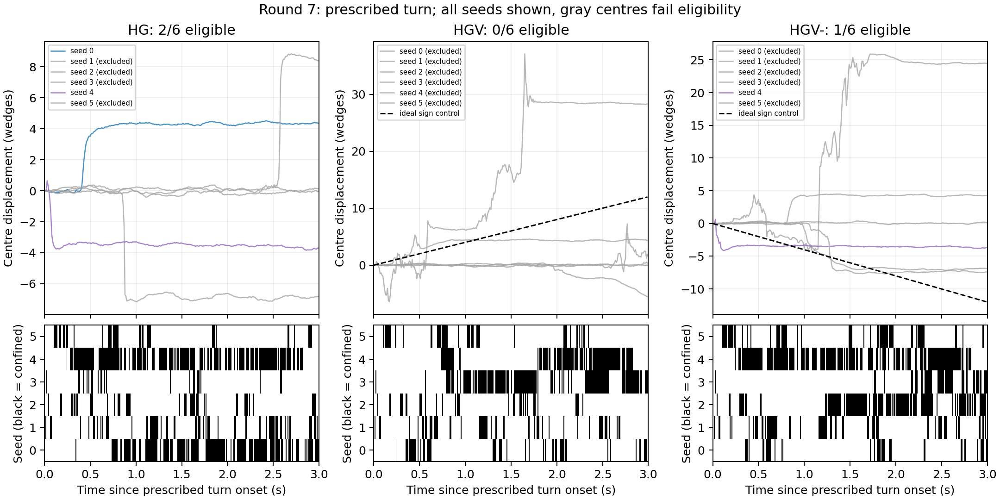
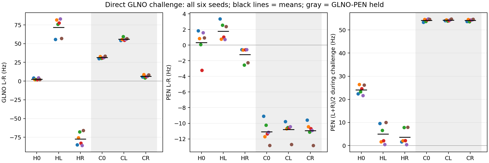

# Compass round 7: the PS196_b velocity route

Protocol written 2026-09-15 before any job was submitted; valid results are in section 5. Ran on the house
cluster (`--target house`), replacement batch `cx8r` after the invalidated `cx8` declaration. Neither round 6B
(`cx7`) nor 4d (`vncd7`) demonstrated a following compass, so the predeclared condition to run this round was met.

## 1. Question

The connectome gives PEN one non-ring input of size, GLNO, and GLNO one large non-ring input, PS196_b (1,801 syn, 19-21 %
of its input; Wang 2026 finding 3, reproduced in our cache to the synapse). Our body-side rounds reach the same cell and
stop there: the ascending report arrives at PS196_b unsigned (NOTES compass round 2: L-R moves the same way in both turn
directions under the Coriolis stop-gap). **If PS196_b is given a signed turn input, does the bump follow the fly's own
turn -- with the ring's DC brake held and GLNO signed -- and does anything downstream (DNa02 L / R) desynchronise?**

## 2. Arms (6 seeds each, prescribed-turn `cx_wedge` protocol)

| arm | instruments | what it tests |
|---|---|---|
| S | none (`raw`) | reference |
| V | `sided_turn_afferent` only | does a signed PS196_b input reach GLNO / PEN at all at shipped gains (predicted: GLNO L-R moves, no bump: the unheld ring has little activity) |
| HG | `ring_dc_hold` + `glno_sign` (= 6A's H3G) | the near-bump without a velocity input (replicates 6A) |
| HGV | `ring_dc_hold` + `glno_sign` + `sided_turn_afferent` | **the arm**: the bump should move with the turn |
| HGV- | HGV with the afferent sign flipped | the sign control: the bump should move the other way, or the effect is not the afferent |
| HGVp | HGV with the hold restricted to PEN (`^(ExR6|ER6|ER4m)$:^PEN_`; EPG keeps its DC input) | added 2026-09-15 after 6B (`compass_local_recurrence.md`; wording corrected after its skeptic): H3E's hump sits near the driven tile but is ~7 wedges wide, and the hold removes ring inhibition from every EPG, driven and off-block alike, so 6B cannot say which part of it matters; HGVp keeps EPG's DC input to test whether that narrows the hump |

The afferent instrument: Poisson `poisson_hz` on AN07B037_a/_b (and CB0675 / GNG580 / PS047_b in a second variant only
if V is null on the first), rate = `k * max(0, +-yaw_deg_s)` on the side the connectome's contralateral routing
implies, `k` swept over {0.25, 0.5, 1.0} Hz per deg/s as **labelled levels, unverified** (no PS196_b recording exists;
search named in `PRESETS_SPEC.md` section 3). One level (0.5) is the predeclared primary; the other two are
descriptive.

## 3. Predeclared measures and family

Primary (Holm, m = 6, 6 v 6 exact U, floor 0.0022 x 6 = 0.013 -- satisfiable; m was 5 until the HGVp arm was added, before submission):

1. `bump_follow_wedges_per_s` HGV vs HG: the bump's mean angular velocity over the turn, sign-matched to the turn
   (ideal 4.0 w/s at 90 deg/s; 6A measured 0.00 +- 0.01 in every arm).
2. `bump_follow_wedges_per_s` HGV vs HGV-: sign flip.
3. `GLNO_LR_hz` V vs S: the afferent reaches GLNO with a side.
4. `PEN_LR_hz` HGV vs HG: the side reaches PEN.
5. `DNa02_LR_hz` HGV vs HG: anything gets back down.
6. `frac_confined_post` HGVp vs HGV: keeping EPG's DC input confines the bump (added with the HGVp arm, 2026-09-15, before submission).

Descriptive (no verdict): bump survival / rate / width per arm as in 6A, the k-sweep (HGVk025, HGVk1 on HGV only),
per-type ring rates (6B's recorded groups, merged at be549c8), PS196_b's own L-R at each k, the afferent / PS196_b /
GLNO / PEN / DNa02 L-R per side. The turn in `cx_wedge` is a prescribed protocol parameter (`--turn 90
--turn-window 0.5:3.5`), not a body: the instrument reads the prescribed yaw, and the body-driven version is the
room run that follows a result. Batch: 8 arms x 6 seeds = 48 jobs in two `cluster_run.py` calls, `out/cx8/batch.sh`,
`set -o pipefail`.

**Eligibility added before submission, 2026-09-15 (instruments review).** Primaries 1 and 2 use only
runs with `bump_follow_confined_frac >= 0.5` over the prescribed turn window. This makes the draft
code's gate explicit before any cx8 result exists. Every excluded run, filename and run id is retained
in the ungated per-seed table; the comparison records the included ids and actual sample sizes.
No eligible measurements is `undetermined`; fewer than four runs in either arm is `underpowered`
under `common.compare`. That first label is this declaration's own word for an empty comparison: `common.compare`
is not called on such a row, and on an empty sample it returns `underpowered`, while INTERP 2.4 / 10.2 reserve
`undetermined` for a deterministic (SD 0) reference arm. Read such rows as unavailable comparisons.
Holm remains one family of six, including missing p values, applied to the
actual eligible samples. The printed `6 * p_floor` is the first-step bound, not an impossibility
claim for a contrast that falls later in the Holm order. A rejected gate is not a zero-velocity observation.

For the functional outcome, 1 and 2 must both be positive `result`s after Holm, the eligible HGV
mean must be positive, and the eligible HGV- mean negative. A difference between two same-direction
drifts does not pass the sign control. `bump_follow_wedges_per_s` is the least-squares slope of the
unwrapped 16-wedge centre on [3.5, 6.5) s of the full 8 s recording, times sign(prescribed yaw).
The 50% confinement criterion is an experimental eligibility rule, not a physiological rate gate.

The generator freezes `out/cx8/predeclared.json` with `--predeclare out/cx8` after review and before
submission: six contrasts, gate, resolved LIF parameters per arm, eight arm specifications, six seeds,
protocol, source SHA-256s (explicit LF normalization), and byte hashes of the generated wrapper and
arm manifest. Existing declarations cannot be overwritten. Both wrapper calls explicitly select
`--target house`, run sequentially with one fetch directory, and abort if either client fails. This is a named
departure from INTERP 10.4 item 3 (one client per `--fetch` directory), mitigated by the strict sequencing and by
the reducer's check that all 48 distinct arm/seed identities appear exactly once.

Verdict vocabulary result / null / underpowered / undetermined per INTERP 10.4. Per-seed scatter emitted by the
analysis script to `out/cx8/analysis/per_seed.csv` and pasted (rule 28). Nothing adopted into `raw` under any outcome;
a `result` on 1 + 2 makes `sided_turn_afferent` + `ring_dc_hold` + `glno_sign` the first `instrumented` list and sends
it to the suite (PRESETS_SPEC section 2 item 5) before any room run.

## 4. What each outcome means

- **1 and 2 positive result, with the sign control satisfied:** the route supports turn following under these
  counterfactual instruments. This establishes model sufficiency, not a unique physiological explanation.
  Next: the suite under `instrumented`, then the odour room with DNa02 L / R as the readout.
- **3 result, 1 null:** the afferent changes GLNO L-R, without demonstrated ring following. Test the GLNO -> PEN
  transfer next; the present contrasts alone cannot identify a receptor or kinetic cause.
- **3 null:** no detected GLNO L-R change from AN07B037 at the primary k=0.5 level in the V arm. Try the declared
  alternative afferents; this is not a null on PS196_b itself or a test of every k in V (the k sweep is on HGV).
- **Anything with HGV- not flipped:** the functional sign-control criterion fails; the individual statistical
  verdicts are retained.

The last rule means the sign-control criterion failed; it does not prove the afferent has no effect.
An unavailable or underpowered follow comparison demonstrates no turn-following compass, and retains
its statistical label. In that case a `result` on 3 authorizes the single GLNO-to-PEN diagnostic
follow-up; a `null` on 3 authorizes the alternate-afferent diagnostic. An underpowered or undetermined
3 leaves the location of the failure unresolved. At most one follow-up batch is permitted and its
arms and decisions must be frozen separately before submission. No null is converted into evidence
of equivalence or a unique receptor mechanism.

## 5. Results: valid replacement cx8r

### 5.1 Answer

The signed afferent reaches GLNO, but this round demonstrates no turn-following compass.
V minus S raises GLNO L-R by +2.2183 Hz (result, Holm p 0.0130). No HGV run passes the predeclared
50% turn-window confinement gate: primaries 1 and 2 are undetermined, with 0 versus 2 and 0 versus 1
eligible runs. These are unavailable comparisons, not zero velocity or statistical nulls.
A hump does form in HG / HGV / HGV- (vector strength ~0.72, ~160 Hz, ~3.9 wedges) and does not rotate: in the
three gate-passing runs the confined-frame centre slope is +0.137, -0.086 and -0.069 wedges/s against the ideal
+4.0, and HGV's nearest miss (seed 3, 0.4667) gives +0.171. The gate fails mostly on its `out_above <= 3` clause,
not on an absent bump.

PEN L-R HGV minus HG is null (+0.7813 Hz, z 0.4221), and DNa02 L-R is null (all values zero).
The PEN-only hold gives no confined post-pulse frames in any seed; its contrast with HGV is null
under the full rule despite Holm p 0.0130, because |z|=2.3613 is below the declared threshold of 3.
The low and high k arms also have only one eligible run each. No arm meets the joint ledger
survival/rate/width criteria, and nothing is adopted.

This result uses 48 CUDA runs in cx8r, six per arm, with zero analysis problems. An independent
CPU trace calculation reproduces 972 measurements and 52 source hashes. The first cx8 attempt
is retained as invalid because Astra's frozen receptor rule was wrong; it is not used for inference.
The selected single follow-up, cx8t, finds a correctly signed PEN side response to a strong direct
GLNO challenge: HL-HR +2.9939 Hz (result, z 3.1904, Holm p 0.00866), with GLNO engagement +149.0748 Hz.
This is transfer under the artificial input, with side-balanced PEN mean falling from H0's 24.0426 Hz
to 5.0211 / 3.6345 Hz in HL / HR. It does not demonstrate a following compass.

The GLNO-PEN edge hold changes the operating state: C0 already has PEN L-R -11.0738 Hz. Both edge
contrasts are positive results; HR-CR +9.7340 Hz is opposite the predeclared negative prediction.
That prediction failed. The controls cannot isolate unitary transfer at matched presynaptic rates.
All 36 follow-up runs pass the frozen checks, including 648 reconstructed trace measurements.
Nothing is adopted; the single follow-up is complete and the suite/odour-room gate remains unmet.
Independent skeptic pass (Opus, 2026-09-17): mostly sound; every quantitative claim in both documents
reproduced and the corrections it required are applied here (see the Skeptic pass section below).

### 5.2 The six primaries

Source: `out/cx8r/analysis/compare.csv`; runs are the replicate unit, one Holm family of six.
The first two rows retain the family slots despite having no eligible HGV observations.
Their label is the frozen declaration's own word for an empty comparison; `common.compare` is not called on those
rows, and on these samples (0 v 2, 0 v 1) it returns `underpowered`, while INTERP 2.4 / 10.2 reserve
`undetermined` for a deterministic (SD 0) reference arm. Read them as unavailable comparisons.

| measure / contrast | n | verdict | difference | z | p | Holm p |
|---|---|---|---:|---:|---:|---:|
| 1_bump_follow_HGV_vs_HG | 0 v 2 | unavailable (declared undetermined) | NA | NA | NA | NA |
| 2_bump_follow_HGV_vs_HGV- | 0 v 1 | unavailable (declared undetermined) | NA | NA | NA | NA |
| 3_GLNO_LR_V_vs_S | 6 v 6 | result | 2.2183 | 1671.8089 | 0.0022 | 0.0130 |
| 4_PEN_LR_HGV_vs_HG | 6 v 6 | null | 0.7813 | 0.4221 | 0.5887 | 1.0000 |
| 5_DNa02_LR_HGV_vs_HG | 6 v 6 | null | 0.0000 | NA | 1.0000 | 1.0000 |
| 6_frac_confined_post_HGVp_vs_HGV | 6 v 6 | null | -0.2637 | -2.3613 | 0.0022 | 0.0130 |

Primary 3's large z (1671.8) is a +2.2183 Hz effect divided by the nearly zero raw-reference SD
(0.0013269 Hz); it is not a claim of a huge absolute signal. All six V values exceed all six S values.
Primary 6 separates by rank but fails the additional |difference/reference SD| >=3 requirement in
`common.compare`; its verdict remains null. Its verdict is orientation-dependent too: HGVp is exactly 0.0000 in
all six runs, so HGV versus HGVp would return `undetermined` on a deterministic reference. Primary 3 is the same
case in reverse -- reversing it gives |z| 2.963 and a null against the +2.2183 Hz difference, whose Welch statistic
is +7.26. DNa02 L and R turn-window rates are zero in every run,
so the equal-zero contrast is null with undefined z, not a detected steering signal.

### 5.3 Eligibility and the saved traces

Eligibility is evaluated on [3.5,6.5) s, 300 frames. Included ids for the two follow contrasts are
`HG_s0.json#0`, `HG_s4.json#0`, and `HGV-_s4.json#0`; HGV includes none.
The original twelve HGV/HGV- velocity values remain in the ungated table below, never substituted for
eligible observations. The 50% gate does not certify physiological rate or continuous tracking.



Generated by `scripts/cx8_plot.py` from the 18 HG / HGV / HGV- NPZs (all six seeds of each follow arm).
Gray means the run fails eligibility. The raster is the per-frame confinement mask. Apparent large unwrapped centre movements during loss of confinement
are not following. Even eligible HG/HGV- traces can jump and then park rather than track the ideal slope.

### 5.4 Descriptive magnitudes and k sweep

Means +/- sample SD from `out/cx8r/analysis/per_seed.csv`; no extra verdicts. Bump rate and width use
confined post-pulse frames only; survival is the end of the last confined frame minus pulse end,
not an assertion of uninterrupted confinement. NA means no confined frame.

| arm | eligible / 6 | survival s | bump Hz | width wedges | post confined fraction | turn confined fraction |
|---|---:|---:|---:|---:|---:|---:|
| S | 0 | 0.0000 +/- 0.0000 | NA | NA | 0.0000 +/- 0.0000 | 0.0000 +/- 0.0000 |
| V | 0 | 0.0000 +/- 0.0000 | NA | NA | 0.0000 +/- 0.0000 | 0.0000 +/- 0.0000 |
| HG | 2 | 4.7750 +/- 0.2857 | 162.5186 +/- 2.6709 | 3.9419 +/- 0.0739 | 0.2980 +/- 0.1608 | 0.2894 +/- 0.2148 |
| HGV | 0 | 4.8533 +/- 0.1726 | 158.3621 +/- 7.9558 | 3.9217 +/- 0.0686 | 0.2637 +/- 0.1117 | 0.2389 +/- 0.1334 |
| HGV- | 1 | 4.8683 +/- 0.1327 | 161.1477 +/- 3.7156 | 3.9269 +/- 0.0653 | 0.2793 +/- 0.1422 | 0.3000 +/- 0.1843 |
| HGVp | 0 | 0.0000 +/- 0.0000 | NA | NA | 0.0000 +/- 0.0000 | 0.0000 +/- 0.0000 |
| HGVk025 | 1 | 4.7833 +/- 0.1757 | 158.0102 +/- 4.8380 | 3.8997 +/- 0.1180 | 0.2627 +/- 0.1105 | 0.2311 +/- 0.2125 |
| HGVk1 | 1 | 4.8400 +/- 0.1463 | 159.8255 +/- 4.9640 | 3.9030 +/- 0.0701 | 0.2610 +/- 0.0976 | 0.2456 +/- 0.1396 |

The HGV k sweep (0.25 / 0.5 / 1.0) is descriptive on the held, GLNO-relabelled ring, not a V sweep.
It raises the actual afferent L-R, the PS196_b side signal, GLNO L-R (2.1845 / 3.7955 / 6.9057 Hz) and PEN L-R
(0.7414 / 1.1072 / 1.6210 Hz) monotonically in k, while turn-window confinement stays flat
(0.2311 / 0.2389 / 0.2456). No k is selected.

| arm | afferent L-R Hz | PS196_b L-R Hz | GLNO L-R Hz | PEN L-R Hz | DNa02 L-R Hz |
|---|---:|---:|---:|---:|---:|
| S | NA | 0.0000 +/- 0.0000 | -0.0000 +/- 0.0013 | 0.0168 +/- 0.0200 | 0.0000 +/- 0.0000 |
| V | 42.6139 +/- 2.4907 | -18.1618 +/- 1.7403 | 2.2183 +/- 0.7486 | 0.0201 +/- 0.0453 | 0.0000 +/- 0.0000 |
| HG | NA | 0.0000 +/- 0.0000 | 2.5705 +/- 1.2286 | 0.3259 +/- 1.8511 | 0.0000 +/- 0.0000 |
| HGV | 42.6139 +/- 2.4907 | -15.6582 +/- 1.9647 | 3.7955 +/- 1.8362 | 1.1072 +/- 0.3454 | 0.0000 +/- 0.0000 |
| HGV- | -44.2544 +/- 1.8199 | 17.0148 +/- 0.7345 | 0.6862 +/- 1.9132 | -0.7082 +/- 1.7688 | 0.0000 +/- 0.0000 |
| HGVp | 42.6139 +/- 2.4907 | -18.1863 +/- 1.6740 | 0.9355 +/- 0.9225 | 0.4425 +/- 0.1386 | 0.0000 +/- 0.0000 |
| HGVk025 | 20.0241 +/- 2.0311 | -3.7866 +/- 1.7394 | 2.1845 +/- 0.8605 | 0.7414 +/- 0.9517 | 0.0000 +/- 0.0000 |
| HGVk1 | 85.1863 +/- 2.9019 | -38.9186 +/- 2.2872 | 6.9057 +/- 1.4805 | 1.6210 +/- 0.5402 | 0.0000 +/- 0.0000 |

The afferent sign control reverses the AFF and PS196_b side reports (-44.2544 and +17.0148 Hz), but GLNO L-R
does not reverse with it (+0.6862 +/- 1.9132 Hz, positive in four of six seeds) and PEN L-R reverses only in the
mean (-0.7082 +/- 1.7688, positive in three of six). No sign-flipped counterpart of the V arm was declared, so the
sign specificity of primary 3's GLNO response is untested where it was measured and is not reproduced in the held
arms. It does not establish opposite eligible compass motion. The k=0.5 law commands 45 Hz Poisson input at
+90 deg/s; the measured afferent spike-rate estimate is about 42.6 Hz. These are different quantities. The law
remains unverified.

The same L-R sits on very different pedestals: V's +2.2183 Hz is GLNO_L 2.59 / GLNO_R 0.37 Hz, while HGVk025's
+2.1845 Hz is 69.76 / 67.57 Hz. Per-side rates are in `out/cx8r/analysis/per_seed.csv`
(`GLNO_L_hz_turn` / `GLNO_R_hz_turn`, and the same for PEN / PS196_b / AFF / DNa02).

| arm | ExR6 pre / pulse / post Hz | ER6 pre / pulse / post Hz | ER4m pre / pulse / post Hz |
|---|---|---|---|
| S | 44.8075 / 85.0330 / 42.4232 | 25.1112 / 51.8955 / 23.5573 | 2.7937 / 11.7478 / 2.6888 |
| V | 44.8075 / 85.0330 / 41.9425 | 25.1112 / 51.8955 / 24.0624 | 2.7937 / 11.7478 / 2.7918 |
| HG | 82.3666 / 212.3720 / 199.7528 | 51.8365 / 152.1098 / 135.8932 | 17.8051 / 55.5079 / 56.3856 |
| HGV | 82.3666 / 212.3720 / 174.6682 | 51.8365 / 152.1098 / 118.6363 | 17.8051 / 55.5079 / 47.4391 |
| HGV- | 82.3666 / 212.3720 / 193.0166 | 51.8365 / 152.1098 / 129.8181 | 17.8051 / 55.5079 / 55.6868 |
| HGVp | 45.9326 / 93.0532 / 43.4631 | 25.0387 / 52.7097 / 24.2715 | 3.3498 / 14.6406 / 3.6218 |
| HGVk025 | 82.3666 / 212.3720 / 183.9557 | 51.8365 / 152.1098 / 125.7980 | 17.8051 / 55.5079 / 49.7776 |
| HGVk1 | 82.3666 / 212.3720 / 191.1707 | 51.8365 / 152.1098 / 131.4960 | 17.8051 / 55.5079 / 51.9294 |

These are observed group rates with the specified outgoing edges held; a held edge does not stop
its presynaptic cells firing. Ring-rate changes are descriptive network responses, not receptor evidence.

### 5.5 Per-seed record

Pasted by the report writer from `out/cx8r/analysis/per_seed.csv`, columns `arm,key,seeds,values`.
Order is seed 0,1,2,3,4,5 throughout; values are not sorted. The corresponding file/run-id mapping
is pasted from the same file (`files`, `run_ids`), so every value below has an explicit source.

| arm | files | run ids |
|---|---|---|
| S | S_s0.json,S_s1.json,S_s2.json,S_s3.json,S_s4.json,S_s5.json | S_s0.json#0,S_s1.json#0,S_s2.json#0,S_s3.json#0,S_s4.json#0,S_s5.json#0 |
| V | V_s0.json,V_s1.json,V_s2.json,V_s3.json,V_s4.json,V_s5.json | V_s0.json#0,V_s1.json#0,V_s2.json#0,V_s3.json#0,V_s4.json#0,V_s5.json#0 |
| HG | HG_s0.json,HG_s1.json,HG_s2.json,HG_s3.json,HG_s4.json,HG_s5.json | HG_s0.json#0,HG_s1.json#0,HG_s2.json#0,HG_s3.json#0,HG_s4.json#0,HG_s5.json#0 |
| HGV | HGV_s0.json,HGV_s1.json,HGV_s2.json,HGV_s3.json,HGV_s4.json,HGV_s5.json | HGV_s0.json#0,HGV_s1.json#0,HGV_s2.json#0,HGV_s3.json#0,HGV_s4.json#0,HGV_s5.json#0 |
| HGV- | HGV-_s0.json,HGV-_s1.json,HGV-_s2.json,HGV-_s3.json,HGV-_s4.json,HGV-_s5.json | HGV-_s0.json#0,HGV-_s1.json#0,HGV-_s2.json#0,HGV-_s3.json#0,HGV-_s4.json#0,HGV-_s5.json#0 |
| HGVp | HGVp_s0.json,HGVp_s1.json,HGVp_s2.json,HGVp_s3.json,HGVp_s4.json,HGVp_s5.json | HGVp_s0.json#0,HGVp_s1.json#0,HGVp_s2.json#0,HGVp_s3.json#0,HGVp_s4.json#0,HGVp_s5.json#0 |
| HGVk025 | HGVk025_s0.json,HGVk025_s1.json,HGVk025_s2.json,HGVk025_s3.json,HGVk025_s4.json,HGVk025_s5.json | HGVk025_s0.json#0,HGVk025_s1.json#0,HGVk025_s2.json#0,HGVk025_s3.json#0,HGVk025_s4.json#0,HGVk025_s5.json#0 |
| HGVk1 | HGVk1_s0.json,HGVk1_s1.json,HGVk1_s2.json,HGVk1_s3.json,HGVk1_s4.json,HGVk1_s5.json | HGVk1_s0.json#0,HGVk1_s1.json#0,HGVk1_s2.json#0,HGVk1_s3.json#0,HGVk1_s4.json#0,HGVk1_s5.json#0 |

| arm | key | seeds | values |
|---|---|---|---|
| S | survival_s | 0,1,2,3,4,5 | 0.0000,0.0000,0.0000,0.0000,0.0000,0.0000 |
| S | bump_hz_post | 0,1,2,3,4,5 | nan,nan,nan,nan,nan,nan |
| S | width_half_post | 0,1,2,3,4,5 | nan,nan,nan,nan,nan,nan |
| S | frac_confined_post | 0,1,2,3,4,5 | 0.0000,0.0000,0.0000,0.0000,0.0000,0.0000 |
| S | bump_follow_confined_frac | 0,1,2,3,4,5 | 0.0000,0.0000,0.0000,0.0000,0.0000,0.0000 |
| S | bump_follow_wedges_per_s | 0,1,2,3,4,5 | 6.9645,2.2765,2.2605,-1.5170,2.8487,2.8004 |
| S | AFF_LR_hz | 0,1,2,3,4,5 | nan,nan,nan,nan,nan,nan |
| S | PS196b_LR_hz | 0,1,2,3,4,5 | 0.0000,0.0000,0.0000,0.0000,0.0000,0.0000 |
| S | GLNO_LR_hz | 0,1,2,3,4,5 | -0.0018,-0.0014,0.0015,0.0003,0.0002,0.0010 |
| S | PEN_LR_hz | 0,1,2,3,4,5 | 0.0322,0.0002,0.0393,0.0333,0.0001,-0.0041 |
| S | DNa02_LR_hz | 0,1,2,3,4,5 | 0.0000,0.0000,0.0000,0.0000,0.0000,0.0000 |
| V | survival_s | 0,1,2,3,4,5 | 0.0000,0.0000,0.0000,0.0000,0.0000,0.0000 |
| V | bump_hz_post | 0,1,2,3,4,5 | nan,nan,nan,nan,nan,nan |
| V | width_half_post | 0,1,2,3,4,5 | nan,nan,nan,nan,nan,nan |
| V | frac_confined_post | 0,1,2,3,4,5 | 0.0000,0.0000,0.0000,0.0000,0.0000,0.0000 |
| V | bump_follow_confined_frac | 0,1,2,3,4,5 | 0.0000,0.0000,0.0000,0.0000,0.0000,0.0000 |
| V | bump_follow_wedges_per_s | 0,1,2,3,4,5 | 6.9784,9.9647,2.2605,-1.5135,2.7974,2.8349 |
| V | AFF_LR_hz | 0,1,2,3,4,5 | 43.3540,43.4948,41.8607,38.0538,45.3305,43.5896 |
| V | PS196b_LR_hz | 0,1,2,3,4,5 | -18.6666,-18.0815,-18.3178,-14.8798,-19.9797,-19.0456 |
| V | GLNO_LR_hz | 0,1,2,3,4,5 | 2.0053,2.6428,2.2497,0.8462,2.6170,2.9488 |
| V | PEN_LR_hz | 0,1,2,3,4,5 | 0.0306,0.0823,0.0379,0.0327,-0.0154,-0.0472 |
| V | DNa02_LR_hz | 0,1,2,3,4,5 | 0.0000,0.0000,0.0000,0.0000,0.0000,0.0000 |
| HG | survival_s | 0,1,2,3,4,5 | 5.0000,4.7600,4.9100,4.9800,4.7700,4.2300 |
| HG | bump_hz_post | 0,1,2,3,4,5 | 160.7983,163.5748,161.2387,164.1680,158.9786,166.3532 |
| HG | width_half_post | 0,1,2,3,4,5 | 4.0000,3.9600,3.9945,3.8519,4.0000,3.8452 |
| HG | frac_confined_post | 0,1,2,3,4,5 | 0.4880,0.2000,0.3640,0.1080,0.4600,0.1680 |
| HG | bump_follow_confined_frac | 0,1,2,3,4,5 | 0.5067,0.2333,0.1633,0.0833,0.6067,0.1433 |
| HG | bump_follow_wedges_per_s | 0,1,2,3,4,5 | 1.1605,0.0277,2.0798,-2.8925,-0.2563,-0.0145 |
| HG | AFF_LR_hz | 0,1,2,3,4,5 | nan,nan,nan,nan,nan,nan |
| HG | PS196b_LR_hz | 0,1,2,3,4,5 | 0.0000,0.0000,0.0000,0.0000,0.0000,0.0000 |
| HG | GLNO_LR_hz | 0,1,2,3,4,5 | 4.0459,1.6952,1.9251,1.6793,4.2543,1.8230 |
| HG | PEN_LR_hz | 0,1,2,3,4,5 | 1.8186,0.8305,0.0555,-3.2348,1.5721,0.9135 |
| HG | DNa02_LR_hz | 0,1,2,3,4,5 | 0.0000,0.0000,0.0000,0.0000,0.0000,0.0000 |
| HGV | survival_s | 0,1,2,3,4,5 | 4.5700,5.0000,4.9900,4.9900,4.7700,4.8000 |
| HGV | bump_hz_post | 0,1,2,3,4,5 | 166.6009,153.8993,161.5561,161.6827,144.4275,162.0063 |
| HGV | width_half_post | 0,1,2,3,4,5 | 3.8939,3.9449,3.9847,4.0000,3.8903,3.8161 |
| HGV | frac_confined_post | 0,1,2,3,4,5 | 0.1320,0.2540,0.2620,0.4500,0.3100,0.1740 |
| HGV | bump_follow_confined_frac | 0,1,2,3,4,5 | 0.1700,0.1833,0.1200,0.4667,0.3333,0.1600 |
| HGV | bump_follow_wedges_per_s | 0,1,2,3,4,5 | 0.0265,-0.0118,-1.3781,1.0026,13.2114,0.4386 |
| HGV | AFF_LR_hz | 0,1,2,3,4,5 | 43.3540,43.4948,41.8607,38.0538,45.3305,43.5896 |
| HGV | PS196b_LR_hz | 0,1,2,3,4,5 | -14.7529,-14.5838,-16.1018,-13.1036,-18.7613,-16.6457 |
| HGV | GLNO_LR_hz | 0,1,2,3,4,5 | 5.2010,4.7047,0.3614,4.9387,3.0920,4.4750 |
| HGV | PEN_LR_hz | 0,1,2,3,4,5 | 0.8673,0.9985,1.7338,1.1978,1.0939,0.7520 |
| HGV | DNa02_LR_hz | 0,1,2,3,4,5 | 0.0000,0.0000,0.0000,0.0000,0.0000,0.0000 |
| HGV- | survival_s | 0,1,2,3,4,5 | 4.7000,4.9800,5.0000,4.9800,4.7700,4.7800 |
| HGV- | bump_hz_post | 0,1,2,3,4,5 | 165.2961,162.9684,162.5770,155.1195,158.3199,162.6055 |
| HGV- | width_half_post | 0,1,2,3,4,5 | 3.8710,3.9259,4.0000,3.8404,4.0000,3.9244 |
| HGV- | frac_confined_post | 0,1,2,3,4,5 | 0.1240,0.2160,0.4800,0.1880,0.4300,0.2380 |
| HGV- | bump_follow_confined_frac | 0,1,2,3,4,5 | 0.1300,0.2267,0.4400,0.1733,0.6067,0.2233 |
| HGV- | bump_follow_wedges_per_s | 0,1,2,3,4,5 | -3.2726,-0.0293,1.6918,12.0726,-0.1796,-3.5662 |
| HGV- | AFF_LR_hz | 0,1,2,3,4,5 | -44.6523,-41.9164,-42.5673,-44.9742,-47.0013,-44.4152 |
| HGV- | PS196b_LR_hz | 0,1,2,3,4,5 | 16.9972,15.7752,16.9131,17.5792,17.9201,16.9041 |
| HGV- | GLNO_LR_hz | 0,1,2,3,4,5 | 0.6346,-0.2667,1.9787,-2.6218,1.8670,2.5254 |
| HGV- | PEN_LR_hz | 0,1,2,3,4,5 | -3.2168,0.3503,0.6704,-0.4745,0.9802,-2.5586 |
| HGV- | DNa02_LR_hz | 0,1,2,3,4,5 | 0.0000,0.0000,0.0000,0.0000,0.0000,0.0000 |
| HGVp | survival_s | 0,1,2,3,4,5 | 0.0000,0.0000,0.0000,0.0000,0.0000,0.0000 |
| HGVp | bump_hz_post | 0,1,2,3,4,5 | nan,nan,nan,nan,nan,nan |
| HGVp | width_half_post | 0,1,2,3,4,5 | nan,nan,nan,nan,nan,nan |
| HGVp | frac_confined_post | 0,1,2,3,4,5 | 0.0000,0.0000,0.0000,0.0000,0.0000,0.0000 |
| HGVp | bump_follow_confined_frac | 0,1,2,3,4,5 | 0.0000,0.0000,0.0000,0.0000,0.0000,0.0000 |
| HGVp | bump_follow_wedges_per_s | 0,1,2,3,4,5 | 13.7019,10.0035,2.9416,4.7291,12.1142,2.8142 |
| HGVp | AFF_LR_hz | 0,1,2,3,4,5 | 43.3540,43.4948,41.8607,38.0538,45.3305,43.5896 |
| HGVp | PS196b_LR_hz | 0,1,2,3,4,5 | -18.7740,-18.1010,-18.6128,-14.9199,-19.5479,-19.1623 |
| HGVp | GLNO_LR_hz | 0,1,2,3,4,5 | 0.4205,0.8473,0.2855,-0.0027,1.6580,2.4043 |
| HGVp | PEN_LR_hz | 0,1,2,3,4,5 | 0.7147,0.4006,0.4205,0.4161,0.3160,0.3872 |
| HGVp | DNa02_LR_hz | 0,1,2,3,4,5 | 0.0000,0.0000,0.0000,0.0000,0.0000,0.0000 |
| HGVk025 | survival_s | 0,1,2,3,4,5 | 5.0000,4.4700,4.8700,4.7700,4.7700,4.8200 |
| HGVk025 | bump_hz_post | 0,1,2,3,4,5 | 151.1527,163.1611,156.3567,163.3758,159.2368,154.7782 |
| HGVk025 | width_half_post | 0,1,2,3,4,5 | 3.9737,3.9043,4.0000,3.7101,4.0000,3.8099 |
| HGVk025 | frac_confined_post | 0,1,2,3,4,5 | 0.2280,0.1880,0.3360,0.1380,0.4440,0.2420 |
| HGVk025 | bump_follow_confined_frac | 0,1,2,3,4,5 | 0.0433,0.2100,0.2500,0.0733,0.6333,0.1767 |
| HGVk025 | bump_follow_wedges_per_s | 0,1,2,3,4,5 | 4.3881,0.0255,-3.4755,-0.0298,-0.2620,-0.0045 |
| HGVk025 | AFF_LR_hz | 0,1,2,3,4,5 | 21.0319,19.2427,19.8771,16.6510,22.7142,20.6277 |
| HGVk025 | PS196b_LR_hz | 0,1,2,3,4,5 | -4.8934,-1.9878,-4.7860,-1.3550,-5.7143,-3.9830 |
| HGVk025 | GLNO_LR_hz | 0,1,2,3,4,5 | 1.4057,2.3191,2.0293,1.4725,3.7781,2.1021 |
| HGVk025 | PEN_LR_hz | 0,1,2,3,4,5 | 0.6346,0.6681,-0.7039,0.7659,2.2973,0.7865 |
| HGVk025 | DNa02_LR_hz | 0,1,2,3,4,5 | 0.0000,0.0000,0.0000,0.0000,0.0000,0.0000 |
| HGVk1 | survival_s | 0,1,2,3,4,5 | 4.6100,4.9800,4.9200,4.9800,4.7700,4.7800 |
| HGVk1 | bump_hz_post | 0,1,2,3,4,5 | 164.1049,161.1237,162.4651,162.2172,158.6591,150.3830 |
| HGVk1 | width_half_post | 0,1,2,3,4,5 | 3.8077,3.8842,3.8491,3.9504,4.0000,3.9267 |
| HGVk1 | frac_confined_post | 0,1,2,3,4,5 | 0.1560,0.1900,0.2120,0.2820,0.4260,0.3000 |
| HGVk1 | bump_follow_confined_frac | 0,1,2,3,4,5 | 0.1733,0.1933,0.1567,0.1600,0.5167,0.2733 |
| HGVk1 | bump_follow_wedges_per_s | 0,1,2,3,4,5 | -0.0003,-0.0168,0.0537,1.2786,-0.1349,-3.3759 |
| HGVk1 | AFF_LR_hz | 0,1,2,3,4,5 | 87.3898,84.6837,82.0996,81.5266,86.8890,88.5292 |
| HGVk1 | PS196b_LR_hz | 0,1,2,3,4,5 | -39.4605,-37.9786,-36.9032,-36.1891,-41.1423,-41.8380 |
| HGVk1 | GLNO_LR_hz | 0,1,2,3,4,5 | 7.4753,7.4790,5.6954,5.8196,9.3528,5.6122 |
| HGVk1 | PEN_LR_hz | 0,1,2,3,4,5 | 1.4230,1.4109,1.4682,1.4926,2.7067,1.2248 |
| HGVk1 | DNa02_LR_hz | 0,1,2,3,4,5 | 0.0000,0.0000,0.0000,0.0000,0.0000,0.0000 |

### 5.6 Provenance, invalid attempt and validation

Valid source: `8d0c6ac`; batch generated before submission and declaration frozen after main merge/push.
Freeze: `2026-09-15T21:12:44Z`; submission: `2026-09-15T21:13:05.390018+00:00`.
Frozen JSON SHA-256: `1e220af99ae700c9617bb0ecb538d62d78ba128405820799fdfc733147e214aa`.
Wrapper SHA-256: `4a65f69adb42cc72a170c7d75616e9c84fe130838bbd5d5cc1ec0d42239d3444`; manifest SHA-256: `50a3474d642e03b43bb6bc55f11775484da24ab75a972e3606fab51f7b84f25c`.
Both archived bytes match, all 48 unique identities and complete resolved LIF records match, both clients
report 24 completed / 0 failed and every console says `device cuda`. Metadata checks: zero problems.
Independent trace verifier: 48 runs, 972 metrics checked, 52 source files including loaded probes, zero issues.
Verifier SHA-256: `15c65c60d23fb8a895c834c648801b8167e14f99c416a23257751d647cdf1f76`; primary reducer SHA-256: `cb91cc196d223ea592cd3e780bd652ff7bd96f39f14fca717041a3599fe63786`.
The original cx8 attempt ran the same physical commands and had a class/abs mismatch only in Astra's new
declaration. All 48 cx8 runs are numerically identical to their cx8r replacements: 6,966 of 6,966 saved metric
values and 1,560 of 1,560 NPZ array pairs are exactly equal, with only run-directory paths and `wall_s`
(different in 47 of 48 runs) distinguishing the records. The replacement is a genuine re-submission that reproduced
the invalidated batch exactly on the same B200 node, so the cx_wedge compass assay is seed-reproducible on this GPU
path across submissions -- recorded as a qualification of INTERP 10.4 item 2 for this protocol only, and not used
to relax it elsewhere. No inference uses cx8's numbers. It remains invalid under `out/cx8/`, with its freeze unchanged, 144 metadata issues in the retained
`out/cx8/invalid_analysis/analysis.json` (48 runs x three checks, written by the pre-correction reducer
`analysis_sha256 307ede2c...`; the corrected reducer reports 48) and 48 model-to-declaration issues in the
independent verifier. No inference uses its numbers. All 48
replacement commands match after substituting only the output directory. See `instruments_review.md` 5.

All arms use the common diagnostic protocol, including compass adaptation held at zero and EPG pulse /
background; S is the raw-preset comparator within that assay, not an unperturbed room. Shipped receptor
setting is sign/abs. MaleCNS CSR MD5 is `ef23cc27bea13be7f6a96f3c04fd3737`; the GLNO scratch graph is
`7a10d93ba2086f2c76bcdabdca79b4ec`. Original three cache file MD5s remain unchanged.

CPU suite at the submitted tree: 469 passed / 19 skipped, 220 subtests, including the original golden.
Closeout full CPU suite also passes: 469 passed / 19 skipped, 220 subtests, 166.40 s
(`out/compass7/cx8_closeout_cpu.log` in the run worktree `flyverse-connectome`; `out/` is git-ignored, so this
log is not in the main checkout); main and worktree cache hashes unchanged.
Astra self-review: compared the primary family to the freeze, checked all trace masks/means and loaded
sources, inspected every follow trace, and retained the small raw SD and rank/effect-rule caveats.
Independent skeptic pass (Opus, 2026-09-17): mostly sound; its verdict line and eight claim lines are quoted
verbatim in the Skeptic pass section at the end of this audit, and its corrections are applied. Nothing adopted.

### 5.7 Outcome

The suite and odour room are conditional on demonstrated following and sign reversal; that condition fails.
The declared branch for primary 3 result and unavailable following therefore selects one GLNO-to-PEN
transfer diagnostic. The present data cannot uniquely assign the failure to a receptor, GLNO amplitude,
PEN recurrence, or confinement. A separate follow-up freeze will state its interventions and decisions.

## 6. Single follow-up: direct GLNO-to-PEN challenge (predeclared before submission)

This is the one follow-up selected by the valid cx8r result in section 5, written before any cx8t GPU
submission. It tests transfer under an explicit neural challenge, not a receptor proposal or an adoption.
Generator, simulator and reducer: `scripts/cx8_transfer.py`. One house submission, six jobs; each job
runs all six conditions on fresh brains at one seed (0-5), for 36 runs. `--arm-block fam` keeps the
seed family together. Existing cache and defaults remain unchanged.

### 6.1 Conditions and intervention

All six conditions use HG's full ring DC hold, GLNO-glutamate scratch graph and common diagnostic
protocol: sign/abs receptors, shipped gains, compass adaptation zero, 1 s settle, EPG wedges 0-3 at
+40 Hz for 2 s on 10 Hz background, 5 s post-pulse. There is no body or signed-turn afferent.
The nominal +90 deg/s clock is retained solely to reuse the [3.5,6.5) s readout window; it is never
fed to proprioception. The intervention is direct Poisson forcing through `FlyBrain.stimulate`, on
both GLNO cells of the named somaSide, for those 3 seconds.

| arm | direct GLNO stimulus | additional held edges |
|---|---|---|
| H0 | none | none |
| HL | left, 90 Hz | none |
| HR | right, 90 Hz | none |
| C0 | none | GLNO -> PEN |
| CL | left, 90 Hz | GLNO -> PEN |
| CR | right, 90 Hz | GLNO -> PEN |

The 90 Hz level is **unverified**, a fixed strong diagnostic challenge. It reuses the highest nominal
Poisson level already declared for the afferent experiment, now delivered to GLNO itself; it is not
matched to GLNO's physiological rate, a fitted gain, or a clamp of its actual firing rate. Actual GLNO
L/R and pre/pulse/post rates will be reported. The dose is not changed in response to the outcome.

The extra `^GLNO$:^PEN_` hold is named `glno_pen_hold`: 84 entries / 16,371 synapses from four GLNO
onto 42 PEN. Counts and descriptions are resolved on the actual signed scratch graph, whose CSR MD5
remains `7a10d93ba2086f2c76bcdabdca79b4ec`. It is an output-path removal control, not a receptor row.
The common `ring_dc_hold` remains 1,149 entries / 37,256 synapses from 17 cells onto 88 PEN/EPG.
Every result names its preset, holds and relabel, target bodyIds, command rate, applied pulse onset,
and the distinction between the unused turn clock and the actual direct neural stimulus.

### 6.2 Four primaries and interpretation

Run means over [3.5,6.5) s; six runs per arm, `common.compare` and one Holm family of four.
The exact-U first-step floor is 4*2/C(12,6)=0.00866, satisfiable. Apply the same |z|>=3 and
sample-size / deterministic-reference rules as section 3. No confinement gate on these neural-rate
measurements. The outcome uses their recorded verdicts: result / null / underpowered / undetermined.

1. `GLNO_LR_hz`, HL versus HR: engagement; expected positive.
2. `PEN_LR_hz`, HL versus HR: transfer; expected positive under the model's inhibitory contralateral
   GLNO projection (left GLNO inhibits right PEN, and conversely).
3. `PEN_LR_hz`, HL versus CL: dependence on the GLNO-PEN edges under the left challenge; expected positive.
4. `PEN_LR_hz`, HR versus CR: dependence under the right challenge; expected negative.

If 1 and 2 are positive results, a strong imposed GLNO side signal can bias PEN at this operating state.
If 1 is a result and 2 is null, no PEN side transfer is detected at the declared challenge level;
this does not establish absent anatomy or identify a receptor/kinetic cause. If engagement fails,
the transfer inference is undetermined regardless of any numerical PEN drift.

Results on 3/4 in the expected directions support dependence of the network response on those edges.
Their removal also changes PEN-to-GLNO feedback and the operating state. H0/C0 are therefore recorded
as descriptive baselines, and all actual GLNO/PEN rates are shown. These are not matched-presynaptic-rate
unitary transfer estimates. Result versus null is not an interaction test, and a null on 3/4 does not
prove independence from the path. Any sign contrary to expectation is retained and reported.

Descriptive only: every side rate, group pre/pulse/post rates, DNa02 L-R, EPG confinement, survival,
rate, width and unwrapped centre motion. No bump tracking or physiological calibration is inferred
from a rate response. No gain, receptor row or model default is adopted, and this diagnostic cannot
unlock the suite/room milestone by itself. No second follow-up batch is authorized in this handoff.

### 6.3 Validation and freeze

The original HG path is unchanged when `neural_stimuli` is absent. The extra pulses are opt-in assay
inputs, applied and expired through the existing control surface, with frame-aligned timing. CPU tests
exercise left, right and held-path pulses on the real graph, compare the complete resolved LIF and
instrument descriptions to the planned records, check target identities and emitted input windows,
and test the family on independent synthetic rate differences. The initial plan test caught a raw
sign-0 count of zero; the plan now resolves the actual GLNO-glutamate graph, matching the run.

Pre-submission full CPU suite: **473 passed / 19 skipped, 220 subtests**, 216.42 s
(`out/compass7/cx8t_full_cpu_final.log`). Original golden and all three MaleCNS cache file MD5s remain
unchanged in main and the worktree. All six planned model records and 36 command identities were checked.

After CPU validation and main merge, `freeze --out out/cx8t` writes an immutable `predeclared.json`
with all 36 run identities, complete model/hold/stimulus descriptions, source SHA-256s (LF normalized),
family and decision rules, and wrapper/manifest byte hashes. Submission is from main on house only.
Analysis verifies these records and independently reconstructs the saved trace metrics and commanded
pulse windows. Every per-seed value is emitted to `out/cx8t/analysis/per_seed.csv` with filenames and run ids.

### 6.4 Result: side transfer with a large operating-state change

The 90 Hz direct challenge engages GLNO and gives the correctly signed PEN L-R difference in the
intact-path arms. HL-HR is +149.0748 Hz at GLNO and +2.9939 Hz at PEN; both are results in the
predeclared four-test family. All six HL PEN L-R values are positive, and all six HR values negative.
This establishes that a strong imposed GLNO side signal can bias PEN under the HG condition.
It does not establish that the smaller signed afferent signal suffices, that the gain is physiological,
or that a confined bump follows a turn. There is no afferent or body in this follow-up.

Source: `out/cx8t/analysis/compare.csv` and `analysis.json`; six fresh-brain runs per arm, one Holm
family of four. All four comparisons separate every run by rank (U=36, two-sided exact p=0.0021645).
The transfer z=3.1904 only modestly clears the additional |z|>=3 threshold; the measured size is
about 3 Hz. Because `common.compare` divides by the reference arm's SD, this verdict is orientation-dependent:
HL versus HR gives z +3.1904 (SD_HR 0.9384) and a `result`, HR versus HL gives z -2.7036 and a `null`. The
symmetric Welch statistic is +5.05 and U = 36 either way. Engagement and both edge contrasts clear |z| >= 3 in
both orientations. A statistical result is distinct from agreement with its directional prediction.

| test / measure | contrast | verdict | difference Hz | z | p | Holm p | prediction |
|---|---|---|---:|---:|---:|---:|---|
| 1_engagement / GLNO_LR_hz | HL-HR | result | +149.0748 | 16.8905 | 0.0021645 | 0.0086580 | positive: met |
| 2_transfer / PEN_LR_hz | HL-HR | result | +2.9939 | 3.1904 | 0.0021645 | 0.0086580 | positive: met |
| 3_left_edge_dependency / PEN_LR_hz | HL-CL | result | +12.5861 | 12.6558 | 0.0021645 | 0.0086580 | positive: met |
| 4_right_edge_dependency / PEN_LR_hz | HR-CR | result | +9.7340 | 9.0518 | 0.0021645 | 0.0086580 | negative: FAILED |

The fourth contrast is **positive**, +9.7340 Hz, contrary to the predeclared negative prediction.
Decomposed against the two unforced baselines, the cut alone moves PEN L-R by +11.3997 Hz (H0 - C0) while the
challenge moves it +1.4585 Hz in HL and -1.5353 Hz in HR, so the challenge-attributable part is +1.1864 Hz for
contrast 3 and -1.6657 Hz for contrast 4 -- the predicted sign in both. The baseline shift is about seven times
the challenge effect, so contrast 4 as declared could not have been negative at any biology. This is a descriptive
decomposition, not a declared test, an interaction claim or a unitary transfer estimate.
It is not recoded as a null, nor described as confirmation of both directional edge tests. The
unforced cut control C0 already has a large negative PEN L-R (-11.0738 Hz); CL and CR stay near it
(-10.8016 / -10.9434 Hz). Thus removing the path shifts the operating state, even without the
direct challenge. The two held-path contrasts mix that shift with the stimulus response; they
do not identify a receptor mechanism or a unitary transfer at matched presynaptic firing rates.

### 6.5 Actual rates and descriptive baselines

All rates below are recorded firing-rate estimates on [3.5,6.5) s, averaged over the cells of each
somaSide; means +/- sample SD across six runs. The 90 Hz command is Poisson input, not a clamp on
these observed rates. Both PEN sides fall below H0 under either intact-path challenge. The stimulated
GLNO side stays near 90 Hz while the opposite side falls to 12.7 Hz (HR's left) and 18.5 Hz (HL's right),
illustrating the network response.

| arm | GLNO L Hz | GLNO R Hz | PEN L Hz | PEN R Hz |
|---|---:|---:|---:|---:|
| H0 | 76.6175 +/- 6.5084 | 74.0470 +/- 7.6132 | 24.2055 +/- 1.9572 | 23.8796 +/- 2.3955 |
| HL | 90.2214 +/- 6.1247 | 18.5214 +/- 15.3470 | 5.9134 +/- 4.7243 | 4.1289 +/- 3.6925 |
| HR | 12.7386 +/- 11.7137 | 90.1134 +/- 4.4860 | 3.0298 +/- 2.8563 | 4.2392 +/- 3.7737 |
| C0 | 151.1239 +/- 1.7265 | 119.7201 +/- 0.8452 | 48.6374 +/- 0.3345 | 59.7112 +/- 1.1748 |
| CL | 176.0093 +/- 1.6088 | 120.0910 +/- 0.6838 | 48.8020 +/- 0.3342 | 59.6036 +/- 0.7632 |
| CR | 151.0628 +/- 1.1583 | 144.6279 +/- 0.8108 | 48.6628 +/- 0.4951 | 59.6063 +/- 0.8490 |

The side-balanced PEN mean, (L+R)/2, is 24.0426 Hz in H0, 5.0211 in HL and 3.6345 in HR;
it is about 54.1-54.2 Hz in all three cut conditions. GLNO itself is also in a different operating
state after the cut: C0 has L/R 151.1239 / 119.7201 Hz versus H0's 76.6175 / 74.0470 Hz. Comparisons
between H and C therefore cannot be read as isolated synapse removal at equal presynaptic drive.
No extra verdict is assigned to C0-H0, CL-CR, or a difference of differences.



Generated by `scripts/cx8_transfer_plot.py` from all 36 checked runs. Colors identify seeds 0-5;
black lines are means and gray marks the GLNO-PEN hold. The third panel uses the side-balanced
mean above, not a population-weighted average over unequally sized side groups.

For the original wedge protocol, group pre/pulse/post rates below refer to [0,1), [1,3), [3,8) s.
Here `pulse` is the EPG wedge input, not the later GLNO challenge. Full per-seed group rates appear
in section 6.6; the post interval includes the challenge and the final 1.5 seconds after it ends.

| arm | GLNO pre / pulse / post Hz | PEN pre / pulse / post Hz |
|---|---|---|
| H0 | 19.5834 / 90.3411 / 75.5029 | 4.8960 / 27.3312 / 24.2029 |
| HL | 19.5834 / 90.3411 / 53.5461 | 4.8960 / 27.3312 / 9.1168 |
| HR | 19.5834 / 90.3411 / 45.7609 | 4.8960 / 27.3312 / 6.5520 |
| C0 | 109.0801 / 129.7427 / 135.7800 | 35.4646 / 44.1855 / 53.7296 |
| CL | 109.0801 / 129.7427 / 143.4403 | 35.4646 / 44.1855 / 53.8002 |
| CR | 109.0801 / 129.7427 / 142.9689 | 35.4646 / 44.1855 / 53.5924 |

The compass diagnostics remain descriptive. No follow contrast was declared for this direct neural
challenge, and the nominal turn is not fed. H0 has two runs above the earlier 50% turn-window
confinement threshold; HL/HR and all cut arms have zero. DNa02 L and R are exactly zero in the
recorded challenge-window means of all 36 runs. No run passes the joint survival/rate/width ledger.

| arm | post confined fraction | challenge-window confined fraction | survival s | confined bump Hz | width wedges |
|---|---:|---:|---:|---:|---:|
| H0 | 0.2980 +/- 0.1608 | 0.2894 +/- 0.2148 | 4.7750 +/- 0.2857 | 162.5186 +/- 2.6709 | 3.9419 +/- 0.0739 |
| HL | 0.1483 +/- 0.1113 | 0.0711 +/- 0.1216 | 4.1633 +/- 1.7813 | 155.6432 +/- 15.8822 | 3.8622 +/- 0.1814 |
| HR | 0.1037 +/- 0.0814 | 0.0456 +/- 0.0555 | 2.8350 +/- 2.4105 | 158.3997 +/- 14.2927 | 3.9778 +/- 0.0497 |
| C0 | 0.0000 +/- 0.0000 | 0.0000 +/- 0.0000 | 0.0000 +/- 0.0000 | NA +/- NA | NA +/- NA |
| CL | 0.0003 +/- 0.0008 | 0.0006 +/- 0.0014 | 0.4233 +/- 1.0370 | 209.0891 +/- NA | 5.0000 +/- NA |
| CR | 0.0000 +/- 0.0000 | 0.0000 +/- 0.0000 | 0.0000 +/- 0.0000 | NA +/- NA | NA +/- NA |

Survival is the end of the last confined frame minus the EPG pulse end, not uninterrupted persistence.
Rate and width use only confined post-pulse frames: HR has five contributing runs, CL only one,
and C0/CR none. CL's one frame at 5.53 s produces survival 2.54 s in seed 1, width 5 and rate
209.0891 Hz; this is not a sustained bump. `NA` marks unavailable means or SDs, never a zero rate.

### 6.6 Per-seed record

Pasted from the script-emitted `out/cx8t/analysis/per_seed.csv`, columns `arm,key,seeds,values`.
All 114 rows are retained, including unqualified centre slopes. Values are in seed order, not sorted.
The same file's `files` and `run_ids` columns map every value to its source below. `nan` in a value
list means no qualifying measurement; it is distinct from the literal statistical verdict `null`.

| arm | files | run ids |
|---|---|---|
| H0 | H0_s0.json,H0_s1.json,H0_s2.json,H0_s3.json,H0_s4.json,H0_s5.json | H0_s0.json#0,H0_s1.json#0,H0_s2.json#0,H0_s3.json#0,H0_s4.json#0,H0_s5.json#0 |
| HL | HL_s0.json,HL_s1.json,HL_s2.json,HL_s3.json,HL_s4.json,HL_s5.json | HL_s0.json#0,HL_s1.json#0,HL_s2.json#0,HL_s3.json#0,HL_s4.json#0,HL_s5.json#0 |
| HR | HR_s0.json,HR_s1.json,HR_s2.json,HR_s3.json,HR_s4.json,HR_s5.json | HR_s0.json#0,HR_s1.json#0,HR_s2.json#0,HR_s3.json#0,HR_s4.json#0,HR_s5.json#0 |
| C0 | C0_s0.json,C0_s1.json,C0_s2.json,C0_s3.json,C0_s4.json,C0_s5.json | C0_s0.json#0,C0_s1.json#0,C0_s2.json#0,C0_s3.json#0,C0_s4.json#0,C0_s5.json#0 |
| CL | CL_s0.json,CL_s1.json,CL_s2.json,CL_s3.json,CL_s4.json,CL_s5.json | CL_s0.json#0,CL_s1.json#0,CL_s2.json#0,CL_s3.json#0,CL_s4.json#0,CL_s5.json#0 |
| CR | CR_s0.json,CR_s1.json,CR_s2.json,CR_s3.json,CR_s4.json,CR_s5.json | CR_s0.json#0,CR_s1.json#0,CR_s2.json#0,CR_s3.json#0,CR_s4.json#0,CR_s5.json#0 |

| arm | key | seeds | values |
|---|---|---|---|
| H0 | GLNO_LR_hz | 0,1,2,3,4,5 | 4.0459,1.6952,1.9251,1.6793,4.2543,1.8230 |
| H0 | PEN_LR_hz | 0,1,2,3,4,5 | 1.8186,0.8305,0.0555,-3.2348,1.5721,0.9135 |
| H0 | DNa02_LR_hz | 0,1,2,3,4,5 | 0.0000,0.0000,0.0000,0.0000,0.0000,0.0000 |
| H0 | GLNO_L_hz_turn | 0,1,2,3,4,5 | 69.9647,83.8093,74.7806,78.9522,68.8034,83.3947 |
| H0 | GLNO_R_hz_turn | 0,1,2,3,4,5 | 65.9188,82.1141,72.8555,77.2729,64.5491,81.5717 |
| H0 | PEN_L_hz_turn | 0,1,2,3,4,5 | 23.2635,26.8027,23.2548,22.9397,22.3819,26.5906 |
| H0 | PEN_R_hz_turn | 0,1,2,3,4,5 | 21.4448,25.9722,23.1993,26.1746,20.8098,25.6771 |
| H0 | frac_confined_post | 0,1,2,3,4,5 | 0.4880,0.2000,0.3640,0.1080,0.4600,0.1680 |
| H0 | bump_follow_confined_frac | 0,1,2,3,4,5 | 0.5067,0.2333,0.1633,0.0833,0.6067,0.1433 |
| H0 | bump_follow_wedges_per_s | 0,1,2,3,4,5 | 1.1605,0.0277,2.0798,-2.8925,-0.2563,-0.0145 |
| H0 | survival_s | 0,1,2,3,4,5 | 5.0000,4.7600,4.9100,4.9800,4.7700,4.2300 |
| H0 | bump_hz_post | 0,1,2,3,4,5 | 160.7983,163.5748,161.2387,164.1680,158.9786,166.3532 |
| H0 | width_half_post | 0,1,2,3,4,5 | 4.0000,3.9600,3.9945,3.8519,4.0000,3.8452 |
| H0 | GLNO_mean_pre | 0,1,2,3,4,5 | 10.5360,58.7765,5.0611,28.5962,10.5492,3.9811 |
| H0 | GLNO_mean_during | 0,1,2,3,4,5 | 90.7722,93.5089,89.3758,87.2937,90.3835,90.7126 |
| H0 | GLNO_mean_post | 0,1,2,3,4,5 | 70.7637,83.2262,73.2103,78.7218,64.0467,83.0485 |
| H0 | PEN_mean_pre | 0,1,2,3,4,5 | 2.1287,16.4631,1.0283,6.5778,2.1496,1.0286 |
| H0 | PEN_mean_during | 0,1,2,3,4,5 | 27.1746,28.9964,26.9063,26.4866,27.2386,27.1844 |
| H0 | PEN_mean_post | 0,1,2,3,4,5 | 23.3643,26.4658,23.0894,24.9302,21.0156,26.3519 |
| HL | GLNO_LR_hz | 0,1,2,3,4,5 | 55.5454,81.5729,75.7738,77.5214,82.9416,56.8453 |
| HL | PEN_LR_hz | 0,1,2,3,4,5 | 3.3384,0.7482,2.5359,1.0169,0.7081,2.3593 |
| HL | DNa02_LR_hz | 0,1,2,3,4,5 | 0.0000,0.0000,0.0000,0.0000,0.0000,0.0000 |
| HL | GLNO_L_hz_turn | 0,1,2,3,4,5 | 91.2239,87.1194,101.1371,85.0600,84.8969,91.8914 |
| HL | GLNO_R_hz_turn | 0,1,2,3,4,5 | 35.6785,5.5465,25.3633,7.5386,1.9553,35.0461 |
| HL | PEN_L_hz_turn | 0,1,2,3,4,5 | 11.1901,1.9819,7.8031,2.5780,0.7870,11.1401 |
| HL | PEN_R_hz_turn | 0,1,2,3,4,5 | 7.8517,1.2337,5.2671,1.5612,0.0789,8.7808 |
| HL | frac_confined_post | 0,1,2,3,4,5 | 0.3460,0.1580,0.1500,0.0140,0.1420,0.0800 |
| HL | bump_follow_confined_frac | 0,1,2,3,4,5 | 0.3133,0.0033,0.0667,0.0033,0.0000,0.0400 |
| HL | bump_follow_wedges_per_s | 0,1,2,3,4,5 | 3.8909,4.5323,-7.8043,-0.0030,-5.0826,-4.3147 |
| HL | survival_s | 0,1,2,3,4,5 | 4.8700,4.9700,4.9200,0.5300,4.9200,4.7700 |
| HL | bump_hz_post | 0,1,2,3,4,5 | 147.2908,151.2521,138.6564,183.8354,149.7922,163.0321 |
| HL | width_half_post | 0,1,2,3,4,5 | 3.9827,4.0000,3.5333,3.8571,4.0000,3.8000 |
| HL | GLNO_mean_pre | 0,1,2,3,4,5 | 10.5360,58.7765,5.0611,28.5962,10.5492,3.9811 |
| HL | GLNO_mean_during | 0,1,2,3,4,5 | 90.7722,93.5089,89.3758,87.2937,90.3835,90.7126 |
| HL | GLNO_mean_post | 0,1,2,3,4,5 | 67.3041,49.0672,63.9249,39.4239,45.3565,56.1999 |
| HL | PEN_mean_pre | 0,1,2,3,4,5 | 2.1287,16.4631,1.0283,6.5778,2.1496,1.0286 |
| HL | PEN_mean_during | 0,1,2,3,4,5 | 27.1746,28.9964,26.9063,26.4866,27.2386,27.1844 |
| HL | PEN_mean_post | 0,1,2,3,4,5 | 14.9685,7.0406,11.4242,4.4774,5.7220,11.0683 |
| HR | GLNO_LR_hz | 0,1,2,3,4,5 | -85.2411,-75.8310,-67.9343,-83.0309,-86.1279,-66.0836 |
| HR | PEN_LR_hz | 0,1,2,3,4,5 | -0.5974,-0.6349,-2.5636,-0.6042,-0.5908,-2.2656 |
| HR | DNa02_LR_hz | 0,1,2,3,4,5 | 0.0000,0.0000,0.0000,0.0000,0.0000,0.0000 |
| HR | GLNO_L_hz_turn | 0,1,2,3,4,5 | 5.7061,7.1412,27.7327,6.5172,1.7385,27.5959 |
| HR | GLNO_R_hz_turn | 0,1,2,3,4,5 | 90.9473,82.9722,95.6670,89.5481,87.8663,93.6795 |
| HR | PEN_L_hz_turn | 0,1,2,3,4,5 | 1.2855,1.7378,6.5084,1.8153,0.0837,6.7479 |
| HR | PEN_R_hz_turn | 0,1,2,3,4,5 | 1.8828,2.3728,9.0720,2.4195,0.6745,9.0136 |
| HR | frac_confined_post | 0,1,2,3,4,5 | 0.1260,0.1300,0.2160,0.0160,0.0000,0.1340 |
| HR | bump_follow_confined_frac | 0,1,2,3,4,5 | 0.0200,0.0167,0.0967,0.0067,0.0000,0.1333 |
| HR | bump_follow_wedges_per_s | 0,1,2,3,4,5 | 6.2042,-2.4405,5.2123,-0.4214,3.1903,-11.8990 |
| HR | survival_s | 0,1,2,3,4,5 | 5.0000,4.9900,5.0000,0.6000,0.0000,1.4200 |
| HR | bump_hz_post | 0,1,2,3,4,5 | 146.0752,147.5869,154.9643,181.2637,nan,162.1085 |
| HR | width_half_post | 0,1,2,3,4,5 | 3.8889,4.0000,4.0000,4.0000,nan,4.0000 |
| HR | GLNO_mean_pre | 0,1,2,3,4,5 | 10.5360,58.7765,5.0611,28.5962,10.5492,3.9811 |
| HR | GLNO_mean_during | 0,1,2,3,4,5 | 90.7722,93.5089,89.3758,87.2937,90.3835,90.7126 |
| HR | GLNO_mean_post | 0,1,2,3,4,5 | 53.9029,44.3451,58.2836,38.5960,30.5379,48.9000 |
| HR | PEN_mean_pre | 0,1,2,3,4,5 | 2.1287,16.4631,1.0283,6.5778,2.1496,1.0286 |
| HR | PEN_mean_during | 0,1,2,3,4,5 | 27.1746,28.9964,26.9063,26.4866,27.2386,27.1844 |
| HR | PEN_mean_post | 0,1,2,3,4,5 | 8.4553,6.2307,10.9473,4.1973,1.2439,8.2376 |
| C0 | GLNO_LR_hz | 0,1,2,3,4,5 | 29.8869,32.6911,30.3560,30.8815,31.4147,33.1926 |
| C0 | PEN_LR_hz | 0,1,2,3,4,5 | -9.1059,-11.7190,-10.2529,-11.3614,-11.1618,-12.8418 |
| C0 | DNa02_LR_hz | 0,1,2,3,4,5 | 0.0000,0.0000,0.0000,0.0000,0.0000,0.0000 |
| C0 | GLNO_L_hz_turn | 0,1,2,3,4,5 | 148.4696,152.7042,149.6721,151.0997,152.3758,152.4222 |
| C0 | GLNO_R_hz_turn | 0,1,2,3,4,5 | 118.5827,120.0131,119.3160,120.2182,120.9611,119.2296 |
| C0 | PEN_L_hz_turn | 0,1,2,3,4,5 | 48.7241,48.6558,48.5174,48.6400,49.1619,48.1253 |
| C0 | PEN_R_hz_turn | 0,1,2,3,4,5 | 57.8300,60.3748,58.7703,60.0014,60.3237,60.9672 |
| C0 | frac_confined_post | 0,1,2,3,4,5 | 0.0000,0.0000,0.0000,0.0000,0.0000,0.0000 |
| C0 | bump_follow_confined_frac | 0,1,2,3,4,5 | 0.0000,0.0000,0.0000,0.0000,0.0000,0.0000 |
| C0 | bump_follow_wedges_per_s | 0,1,2,3,4,5 | 0.4133,0.1433,0.2109,0.1448,0.0387,0.1116 |
| C0 | survival_s | 0,1,2,3,4,5 | 0.0000,0.0000,0.0000,0.0000,0.0000,0.0000 |
| C0 | bump_hz_post | 0,1,2,3,4,5 | nan,nan,nan,nan,nan,nan |
| C0 | width_half_post | 0,1,2,3,4,5 | nan,nan,nan,nan,nan,nan |
| C0 | GLNO_mean_pre | 0,1,2,3,4,5 | 129.9327,125.1782,32.1891,115.8105,120.4698,130.9001 |
| C0 | GLNO_mean_during | 0,1,2,3,4,5 | 128.6062,129.3197,117.1816,140.3660,133.0743,129.9086 |
| C0 | GLNO_mean_post | 0,1,2,3,4,5 | 134.3837,136.4193,135.6588,136.0668,136.7215,135.4300 |
| C0 | PEN_mean_pre | 0,1,2,3,4,5 | 42.5349,41.0964,8.8371,35.2628,42.1287,42.9278 |
| C0 | PEN_mean_during | 0,1,2,3,4,5 | 43.7213,43.9228,38.9926,47.9348,46.3704,44.1711 |
| C0 | PEN_mean_post | 0,1,2,3,4,5 | 52.9700,53.9653,53.5967,53.9396,54.1641,53.7417 |
| CL | GLNO_LR_hz | 0,1,2,3,4,5 | 54.1659,55.4505,59.3179,54.4219,55.5876,56.5657 |
| CL | PEN_LR_hz | 0,1,2,3,4,5 | -9.7918,-10.7050,-10.5520,-10.5957,-10.4444,-12.7209 |
| CL | DNa02_LR_hz | 0,1,2,3,4,5 | 0.0000,0.0000,0.0000,0.0000,0.0000,0.0000 |
| CL | GLNO_L_hz_turn | 0,1,2,3,4,5 | 174.4912,176.1892,178.6621,174.1973,176.5403,175.9757 |
| CL | GLNO_R_hz_turn | 0,1,2,3,4,5 | 120.3253,120.7387,119.3442,119.7754,120.9527,119.4100 |
| CL | PEN_L_hz_turn | 0,1,2,3,4,5 | 49.1189,48.9809,48.5455,48.6969,49.1472,48.3224 |
| CL | PEN_R_hz_turn | 0,1,2,3,4,5 | 58.9107,59.6859,59.0974,59.2927,59.5915,61.0433 |
| CL | frac_confined_post | 0,1,2,3,4,5 | 0.0000,0.0020,0.0000,0.0000,0.0000,0.0000 |
| CL | bump_follow_confined_frac | 0,1,2,3,4,5 | 0.0000,0.0033,0.0000,0.0000,0.0000,0.0000 |
| CL | bump_follow_wedges_per_s | 0,1,2,3,4,5 | 0.4031,0.2456,0.2725,0.1623,0.1037,0.1328 |
| CL | survival_s | 0,1,2,3,4,5 | 0.0000,2.5400,0.0000,0.0000,0.0000,0.0000 |
| CL | bump_hz_post | 0,1,2,3,4,5 | nan,209.0891,nan,nan,nan,nan |
| CL | width_half_post | 0,1,2,3,4,5 | nan,5.0000,nan,nan,nan,nan |
| CL | GLNO_mean_pre | 0,1,2,3,4,5 | 129.9327,125.1782,32.1891,115.8105,120.4698,130.9001 |
| CL | GLNO_mean_during | 0,1,2,3,4,5 | 128.6062,129.3197,117.1816,140.3660,133.0743,129.9086 |
| CL | GLNO_mean_post | 0,1,2,3,4,5 | 142.7549,144.1700,144.3496,143.1951,143.4552,142.7171 |
| CL | PEN_mean_pre | 0,1,2,3,4,5 | 42.5349,41.0964,8.8371,35.2628,42.1287,42.9278 |
| CL | PEN_mean_during | 0,1,2,3,4,5 | 43.7213,43.9228,38.9926,47.9348,46.3704,44.1711 |
| CL | PEN_mean_post | 0,1,2,3,4,5 | 53.4648,54.1251,53.7510,53.8875,53.6823,53.8903 |
| CR | GLNO_LR_hz | 0,1,2,3,4,5 | 5.4873,8.5991,4.1262,5.6854,6.5193,8.1922 |
| CR | PEN_LR_hz | 0,1,2,3,4,5 | -9.6011,-10.4489,-11.1327,-10.6967,-10.9302,-12.8510 |
| CR | DNa02_LR_hz | 0,1,2,3,4,5 | 0.0000,0.0000,0.0000,0.0000,0.0000,0.0000 |
| CR | GLNO_L_hz_turn | 0,1,2,3,4,5 | 149.9236,151.8005,149.6678,150.8829,151.3673,152.7346 |
| CR | GLNO_R_hz_turn | 0,1,2,3,4,5 | 144.4363,143.2014,145.5416,145.1975,144.8480,144.5424 |
| CR | PEN_L_hz_turn | 0,1,2,3,4,5 | 48.8376,49.2653,47.9733,48.8797,48.8732,48.1479 |
| CR | PEN_R_hz_turn | 0,1,2,3,4,5 | 58.4387,59.7142,59.1060,59.5764,59.8034,60.9989 |
| CR | frac_confined_post | 0,1,2,3,4,5 | 0.0000,0.0000,0.0000,0.0000,0.0000,0.0000 |
| CR | bump_follow_confined_frac | 0,1,2,3,4,5 | 0.0000,0.0000,0.0000,0.0000,0.0000,0.0000 |
| CR | bump_follow_wedges_per_s | 0,1,2,3,4,5 | 0.3931,0.1320,0.2399,0.1502,0.0009,0.0747 |
| CR | survival_s | 0,1,2,3,4,5 | 0.0000,0.0000,0.0000,0.0000,0.0000,0.0000 |
| CR | bump_hz_post | 0,1,2,3,4,5 | nan,nan,nan,nan,nan,nan |
| CR | width_half_post | 0,1,2,3,4,5 | nan,nan,nan,nan,nan,nan |
| CR | GLNO_mean_pre | 0,1,2,3,4,5 | 129.9327,125.1782,32.1891,115.8105,120.4698,130.9001 |
| CR | GLNO_mean_during | 0,1,2,3,4,5 | 128.6062,129.3197,117.1816,140.3660,133.0743,129.9086 |
| CR | GLNO_mean_post | 0,1,2,3,4,5 | 142.6288,143.3593,143.4666,143.3115,142.0955,142.9515 |
| CR | PEN_mean_pre | 0,1,2,3,4,5 | 42.5349,41.0964,8.8371,35.2628,42.1287,42.9278 |
| CR | PEN_mean_during | 0,1,2,3,4,5 | 43.7213,43.9228,38.9926,47.9348,46.3704,44.1711 |
| CR | PEN_mean_post | 0,1,2,3,4,5 | 53.2564,54.1079,53.5328,53.8579,53.1342,53.6650 |

### 6.7 Provenance, self-review and handback

The declaration was frozen at **2026-09-15 21:46:49 UTC** on merged/pushed main `036e512`.
The one house submission began at **21:47:13.104742 UTC**; all six seed jobs completed, zero failures,
and all 36 JSON/NPZ/console triplets were fetched. The local `submitted_at.txt`, `client_stdout.txt`
and unchanged `predeclared_archive.json` preserve the submission record.

Fingerprint block (byte SHA-256 unless labelled LF):

```text
declaration 16a9230d07d87ba73bb1dc252d4ce4306d228450f43b1a61a6466e0fd3e88295
batch.sh    27c0af904808220eadffecc672defe078923ec0dc7faf8dc262f82ed692c8a03
arms.json   981214f34ce27c91b14733a7f91eccf74f50354ad2bd8b67f0dcc5d2bb44b0cd
generator/reducer LF ee06dbde3973414c1873e01fe3837fd5a53a1c4e3aad6decaa5904e148abace5
trace verifier LF    15c65c60d23fb8a895c834c648801b8167e14f99c416a23257751d647cdf1f76
MaleCNS CSR MD5      ef23cc27bea13be7f6a96f3c04fd3737
GLNO scratch CSR MD5 7a10d93ba2086f2c76bcdabdca79b4ec
```

Reproduction, CPU only after fetch:

```text
python scripts/cx8_transfer.py analyse --out out/cx8t
python scripts/cx8_transfer_verify.py --runs out/cx8t --reference out/cx8r --commit 036e512
python scripts/cx8_transfer_plot.py --runs out/cx8t/analysis/runs.csv --out out/cx8t/analysis/transfer.png
```

The reducer reports **36 runs, zero problems, 648 trace checks**. It checks full resolved LIF,
hold counts/descriptions, GLNO target bodyIds and transmitter override, event onset and all 800
command frames, CUDA consoles, preset, recorded source hashes and frozen protocol. The command
matrix is empty for H0/C0, and exactly 90 Hz on frames 350-649 for the four stimulated arms.
The recorded turn clock is never fed. The independent trace calculation uses the original
confinement rule and a 5e-5 absolute / 1e-6 relative float32 reduction tolerance, not a fitted rule.

The separate source/control verifier ties **all 72 frozen source hashes and all 58 recorded source
hashes** to the submitted commit. Three recorded files were not in the frozen source list:
`flyverse/data/manifest.json`, `scripts/interp_export.py`, `scripts/probe_object_sweep.py`; their
hashes agree with `036e512` as a retrospective source check. They are not described as frozen.
All six H0 seeds exactly reproduce the earlier HG run's **138 metrics and 31 NPZ arrays per seed**.
Output: `out/cx8t/verification/sources_and_control.json`. The separate verifier and plot generator
were added after submission and do not change any simulation or analysis result.

**Astra self-review:** all four directional predictions are visible, including the failed fourth.
The table preserves statistical `result` versus directional failure; baseline and actual side rates
travel with the interpretation. There is no fitted level, causal receptor claim, or result-versus-null
interaction claim. Section 5.2 also corrects three rendered `nan` verdict cells to `null`: pandas'
CSV NA parsing caused that documentation error; the saved verdicts and prose were already `null`.
Every per-seed row and the Report summary are checked against their sources. Final full CPU suite: **473 passed / 19 skipped,
220 subtests**, 217.19 s (`out/compass7/cx8t_closeout_cpu.log`), including the unchanged golden.
All three MaleCNS cache file MD5s remain unchanged in main and the worktree.

The single authorized follow-up is complete. Direct challenge establishes a PEN side response under
HG, while the round-7 afferent experiment still has no qualifying following/sign-reversal result.
The conditional benchmark suite and odour room are therefore **not run**. No default, gain or
receptor row is adopted; `raw` remains unchanged. No second follow-up is submitted. The independent skeptic
pass (Opus, 2026-09-17) is complete and quoted at the end of this audit; this self-review does not replace it.

## Report

```yaml
summary: |-
  The signed afferent reaches GLNO, but this round demonstrates no turn-following compass.
  V minus S raises GLNO L-R by +2.2183 Hz (result, Holm p 0.0130). No HGV run passes the predeclared
  50% turn-window confinement gate: primaries 1 and 2 are undetermined, with 0 versus 2 and 0 versus 1
  eligible runs. These are unavailable comparisons, not zero velocity or statistical nulls.
  A hump does form in HG / HGV / HGV- (vector strength ~0.72, ~160 Hz, ~3.9 wedges) and does not rotate: in the
  three gate-passing runs the confined-frame centre slope is +0.137, -0.086 and -0.069 wedges/s against the ideal
  +4.0, and HGV's nearest miss (seed 3, 0.4667) gives +0.171. The gate fails mostly on its `out_above <= 3` clause,
  not on an absent bump.

  PEN L-R HGV minus HG is null (+0.7813 Hz, z 0.4221), and DNa02 L-R is null (all values zero).
  The PEN-only hold gives no confined post-pulse frames in any seed; its contrast with HGV is null
  under the full rule despite Holm p 0.0130, because |z|=2.3613 is below the declared threshold of 3.
  The low and high k arms also have only one eligible run each. No arm meets the joint ledger
  survival/rate/width criteria, and nothing is adopted.

  This result uses 48 CUDA runs in cx8r, six per arm, with zero analysis problems. An independent
  CPU trace calculation reproduces 972 measurements and 52 source hashes. The first cx8 attempt
  is retained as invalid because Astra's frozen receptor rule was wrong; it is not used for inference.
  The selected single follow-up, cx8t, finds a correctly signed PEN side response to a strong direct
  GLNO challenge: HL-HR +2.9939 Hz (result, z 3.1904, Holm p 0.00866), with GLNO engagement +149.0748 Hz.
  This is transfer under the artificial input, with side-balanced PEN mean falling from H0's 24.0426 Hz
  to 5.0211 / 3.6345 Hz in HL / HR. It does not demonstrate a following compass.

  The GLNO-PEN edge hold changes the operating state: C0 already has PEN L-R -11.0738 Hz. Both edge
  contrasts are positive results; HR-CR +9.7340 Hz is opposite the predeclared negative prediction.
  That prediction failed. The controls cannot isolate unitary transfer at matched presynaptic rates.
  All 36 follow-up runs pass the frozen checks, including 648 reconstructed trace measurements.
  Nothing is adopted; the single follow-up is complete and the suite/odour-room gate remains unmet.
  Independent skeptic pass (Opus, 2026-09-17): mostly sound; every quantitative claim in both documents
  reproduced and the corrections it required are applied here (see the Skeptic pass section below).
key_claims:
- The signed afferent changes GLNO L-R in V; the absolute primary effect is +2.2183 Hz.
- HGV has zero eligible follow runs. Both follow contrasts are undetermined; no eligible sign reversal is demonstrated.
- The round-7 PEN and DNa02 L-R contrasts are null under the declared rule.
- The PEN-only confinement contrast fails the z requirement; the k sweep selects no gain.
- Direct GLNO forcing gives a correctly signed PEN side response of +2.9939 Hz at the declared strong challenge.
- PEN mean falls under direct forcing; the edge hold changes the baseline, and the right-edge sign prediction fails.
- Neither batch produces a joint ledger compass success or an adoption.
validation:
- cx8r has 48 valid CUDA runs, zero problems, 972 measurements and 52 source hashes checked on CPU.
- cx8t has 36 valid CUDA runs, zero problems and 648 independently reconstructed measurements.
- All 72 frozen and 58 recorded cx8t source hashes agree with the submitted commit; three recorded files were not frozen.
- Every H0 seed exactly reproduces the earlier HG metrics and arrays.
- Submitted and closeout CPU suites each passed 473 tests, with 19 skipped and 220 subtests; golden and cache unchanged.
- Initial cx8 invalidated for a declaration error, retained separately without inference.
- Independent skeptic pass (Opus, 2026-09-17): mostly sound; every quantitative claim reproduced, corrections
  applied, no verdict moved.
recommendations:
- Nothing adopted; raw remains the default.
- The one authorized follow-up is complete. The following/sign-reversal gate remains unmet, so no suite or room is run.
open_questions:
- How to obtain a stable confined bump that tracks a signed afferent input without suppressing relay activity.
- A physiological receptor and kinetic account remains unresolved; the direct challenge does not identify one.
```


## Skeptic pass (independent, Opus, 2026-09-17)

An independent skeptic pass ran on 2026-09-17 (Opus, CPU only, no cluster job, nothing adopted). Its verdict line
and its claim lines are quoted verbatim below. The CORRECTIONS REQUIRED list is applied in place in the sections
above; where a correction replaced a sentence that stated a finding, the original sentence stays in the record
marked **Withdrawn:** (INTERP 10.4 rule 29 iii). The pass's NOT CHECKED list is recorded verbatim with this
round's entry in [receptor_verification.md](receptor_verification.md).

The pass covers this audit (sections 5-6 and the Report block); it is the round-7 / cx8r / cx8t pass.

### Verdict

```text
VERDICT: mostly sound
```

### Claims

```text
CLAIMS:
1. cx8 invalidation -- REPRODUCED, and the runs were fine: declarations differ only in protocol.receptor_net_rule class/abs; all 96 run records say sign/abs; cx8 vs cx8r 6,966/6,966 metrics and 1,560/1,560 NPZ arrays exactly equal. "144 metadata issues" reproduces only from the retained out/cx8/invalid_analysis/analysis.json (48 x 3, reducer analysis_sha256 307ede2c...); the corrected reducer gives 48, and cx8_verify.py gives 48 model-to-declaration issues.
2. cx8r's six primaries -- REPRODUCED exactly, twice: +2.2183/z 1671.8089/p 0.0021645/p_holm 0.012987; 0v2 and 0v1 with eligible ids HG_s0#0, HG_s4#0, HGV-_s4#0; +0.7813/z 0.4221; 0.0000/p 1.0; -0.2637/z -2.3613/p_holm 0.012987. Gate was frozen pre-submission -- follow_gate_confined_frac 0.5 is in out/cx8/predeclared.json (20:59:55Z, submitted 21:00:59Z) and audit sections 1-4 are byte-identical from 838d999 to HEAD. Vocabulary -- NOT REPRODUCED: common.compare([], vb) returns underpowered (n_min 0), the script never calls it for those rows (cx_velocity_route.py 424-425 hardcodes the string), and INTERP 2.4/10.2 reserve undetermined for a deterministic (SD 0) reference.
3. Physical picture -- REPRODUCED. Afferent reaches both cells with a side: AFF 42.61/0.00, PS196b 0.00/18.16, GLNO 2.59/0.37 in V and 69.17/65.37 in HGV. The bump is not absent in HG/HGV/HGV-: vector strength ~0.72, in-block fraction 0.95-1.00, 158-163 Hz, 3.92 wedges, survival ~4.8 s -- the confined predicate fails mostly on its out_above <= 3 clause (epg_out_mean_post 14-52 Hz). S, V and HGVp have no bump at all (all six frac_confined_post = 0.0000). Joint ledger 0/48. Confined-frame slopes: HG_s0 +0.137, HG_s4 -0.086, HGV-_s4 -0.069, HGV_s3 +0.171 w/s vs ideal +4.0; HGV_s4's +13.2114 collapses to +3.315 on its confined frames. So a hump forms and does not rotate. Sign control partly fails, unreported: GLNO L-R does not reverse in HGV- (+0.6862 +- 1.9132, positive in 4/6) and no V- arm exists.
4. cx8t -- REPRODUCED exactly: 36 runs / 0 problems / 648 trace checks; +149.0748 z 16.8905, +2.9939 z 3.1904, +12.5861 z 12.6558, +9.7340 z 9.0518, all p 0.0021645 / p_holm 0.0086580. Suppression reproduced (24.0426 -> 5.0211/3.6345; stimulated side 90.2/90.1, opposite 18.52/12.74). The HR-CR sign failure IS an artefact of the operating-state shift: cut alone H0-C0 = +11.3997; challenge HL-H0 = +1.4585, HR-H0 = -1.5353; challenge-attributable part of contrast 3 = +1.1864 and of contrast 4 = -1.6657, i.e. the predicted sign in both. The baseline shift is ~7x the challenge, so contrast 4 as declared could not have been negative at any biology. The audit's refusal to infer unitary transfer or a receptor sign is justified, not over-cautious -- but it hides this decomposition.
5. H0 == HG -- REPRODUCED: 138 metrics / 31 arrays for all six seeds, 72 frozen + 58 recorded hashes tied to 036e512.
6. Provenance -- REPRODUCED. Presets/instruments/holds per arm exactly as tabled; md5 sharing ef23cc27... for S+V (12 runs) and 7a10d93b... for the 36 relabelled cx8r runs + all 36 cx8t runs; 48/48 and 36/36 consoles say device cuda, all NVIDIA B200 on one node, blocks fam_s0..s5 (8 and 6 jobs, no one-job block, no device crossing); declarations 1e220af9.../16a9230d... byte-equal to archives; 70/70, 70/70, 72/72 frozen source hashes match their commits, zero recorded-hash mismatches.
7. Per-seed lists and plots -- REPRODUCED: 202/202 audit rows (88 + 114) match an emitted per_seed.csv row exactly; 20/20 spot-checks re-derived from run JSONs; both docs/audits/assets/ PNGs md5-identical to the analysis outputs. Caption REFUTED: cx8_plot.py loops ('HG','HGV','HGV-') x 6 seeds = 18 of 48 NPZs, not "every NPZ".
8. Prose/tables/vocabulary/branch -- REPRODUCED: 5.1 Answer and Report.summary byte-identical; 5.4's three tables reproduce cell for cell; "all six V exceed all six S" true (V min 0.8462 vs S max 0.0015). "The round-7 afferent following gate remains unmet" is true as written. The branch chosen is exactly the one the freeze prescribes, one batch only. No claim beyond what the arms can show.
```
