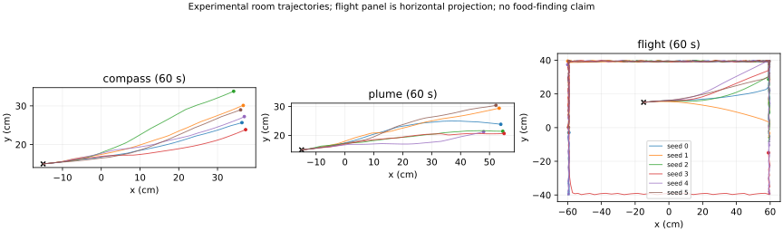

# Navigation instruments: recurrent memory, goals, metabolic gain, flight

2026-09-15, Astra. Experimental opt-ins; self-review only. No change to the raw default,
parent synapses, receptors, neurotransmitter labels, or body constants. Independent review
is pending Fable. This is implementation and engineering validation, not preset admission.

## 1. Scope and sources

The owner requested a more direct implementation of Wang's ideas and their primary sources,
plus plume tracking, flight, and an optional metabolic gain. Five names compose under
`--preset instrumented --instruments ...`: the existing `compass`, its alternative
`compass_ring`, `plume`, `hunger`, and `flight`. The two heading providers are incompatible.
Plume requires one heading provider. Hunger requires plume or flight. Duplicate names and
overlapping neural writes are errors. Missing target populations are errors, not silent no-ops.

| source | implementation and limit |
|---|---|
| [Wang, pinned 80b94e6](https://github.com/pwang724/fly-circuit-exploration/tree/80b94e6608cf927ca2c9f2bbce0577c5a998684c), `simulations/eb_epg_pen_loop.py`, finding 4 | Independently expressed 16 EPG / 16 PEN rate dynamics. No external code is imported or executed. Noise is zero instead of Wang's 0.02; gains and units below are explicit. |
| [Turner-Evans et al. 2017, eLife 23496](https://elifesciences.org/articles/23496), model section | Shifted PEN recurrence supplies angular memory. Our reduced model is Wang's version, not the paper's full 54 EPG / 18 PEN model or a recovered native circuit. |
| [Mussells Pires et al. 2024](https://doi.org/10.1038/s41586-023-07006-3), Methods, "Full PFL3 model", PDF pp. 17-18 | The published 12-cell-per-LAL heading/goal comparator and preferred-angle arrays are implemented directly. Its aggregate output is translated to biological PFL3 sides by an engineering bridge, not a cell-by-cell anatomical correspondence. |
| [Matheson et al. 2022](https://doi.org/10.1038/s41467-022-32247-7), Fig. 7, and [2024 addendum](https://doi.org/10.1038/s41467-024-46225-8) | Odor-gated allocentric wind goals motivate the input combination. The VT062617 physiology/behavior cannot be assigned confidently to hDeltaC alone: the addendum identifies hDeltaK labeling. This implementation assigns no native hDelta identity. |
| [Siliciano et al. 2026](https://doi.org/10.1038/s41586-026-10827-7), published July 22, goal-memory/model sections | Entry-bearing memory motivates walking returns after odor loss. This is a reduced hybrid policy, not the full stochastic leaving/returning model; it stores direction, not displacement or source coordinates. |
| [van Breugel and Dickinson 2014](https://doi.org/10.1016/j.cub.2013.12.023), odor-loss casting results | Horizontal casting after loss, with a 0.45 s delay. The measured delay was 450 +/- 165 ms; our clock begins after an engineering odor filter/hysteresis, so total latency is not that measurement. No vertical casting or visual wind estimation is implemented. |
| [Root et al. 2011](https://doi.org/10.1016/j.cell.2011.02.008) | Insulin/sNPF modulation of specific ORNs supports state-dependent food search. Our instantaneous global navigation gain is explicitly an engineering alternative, not Or42b/sNPFR1 kinetics or a claimed hunger-neuron identity. |
| [Namiki et al. 2022](https://pmc.ncbi.nlm.nih.gov/articles/PMC9206711/), DNg02 population flight-power results | Supports investigating descending wing-power control during flight; does not establish takeoff sufficiency. Our flight controller bypasses that unsolved circuit and drives biological wing MNs. |

The published Siliciano PDF in the ignored research checkout has SHA-256
`bc4cd16a77681a7e90d96464c456f04999c84aa69009b725ab345a8369f3558b`.
The newer connectome-fitting leads remain research leads: [Duan, Dong and Fiete 2025](https://doi.org/10.1101/2025.05.26.655406)
and [Hulse et al. 2026](https://www.janelia.org/publication/hidden-symmetries-in-network-connectivity-support-ring-attractor-dynamics-in-the-flys).
The latter uses a hidden-symmetry construction; it is not simply a transmitter sign correction.
No fitted parameters from either are claimed here. Wang's EB-brake diagnostic does not show
that biological EB contacts must be removed: contact counts are not effective synaptic gains.

## 2. Laws and boundaries

**compass_ring.** Memory is recurrent rates `e[16]`, `p[16]`, not an integrated angle variable.
With 2 ms substeps and tau = 50 ms, PEN is updated first using rectified EPG input and sided
gains `1-v`, `1+v`; EPG then uses local excitation plus shifted PEN return minus `4.8*mean(e)`.
Local excitation is `0.6*exp(-distance_in_wedges^2/2)`. PB input = 1, PEN return = 0.8 at
each of two target wedges, EPG cap = 5. EB input is `eb_ratio/2` at each target wedge.
The default EB/PB ratio 0 is a **textbook counterfactual**, never a parent edge deletion.
The diagnostic ratio 2.7 is a hemibrain count ratio, not measured efficacy in MaleCNS.
`v = clip(yaw_rad_s * (0.3/(pi/2)), -0.8, 0.8)` is **uncalibrated**; 90 deg/s input does
not imply 90 deg/s bump velocity. Output to existing EPGs is `0.0001 + 10*e[wedge]` Poisson Hz.
No visual anchoring, tilt compensation, or inference of the native operating state is supplied.

**plume.** Reads biological EPG rates, occupancy-balanced across 16 wedges, and the existing
berry/apple LH channels. Uses antennal deflections through `FlyBrain.wind`: `dL+dR` and `dL-dR`
give incoming-wind forward/left components in the shipped sensor geometry. It receives neither
world heading nor wind angle, source coordinates, distance, or motor commands. The goal lives
in an ideal FC2-like memory, not biological FC2 cells. In-odor goal = heading + body-relative
upwind angle. Walking reentry goal = exponentially averaged entry-heading vector (learning 0.5).
Flight outside odor alternates +/-90 degrees around upwind every 1.5 s. This policy can miss
the plume; it has no source-localization or landing policy.

Odor uses the preexisting model LH calibration: berry `(Hz-10)/12`, apple `(Hz-5)/8`, maximum
clipped to [0,1], tau 1 s, enter >0.6 / leave <0.25. Return memory decays over 30 s, weight 0.35;
loss clock saturates at one hour. These are **unverified engineering choices**, not new fits.
Unconfined heading (strength <0.6) suppresses navigation; feeding suppresses it too.

The comparator is `r = 29.23*softplus(2.17*(cos(H-Hpref)+0.63*cos(G-Gpref)-0.7))` Hz,
with both complete preferred-angle arrays from the cited Methods. Those arrays are irregular,
so the population readout has small heading-dependent variation. R-L follows positive goal
error in this declared coordinate convention, checked across a heading grid. The difference
divided by 40 Hz, multiplied by odor/memory and optional hunger gain, is clipped to [-1,1].
Positive values drive PFL3 soma-R, negative drive soma-L, up to 80 Hz; DNp09 gets up to 60 Hz.
These injection gains and the soma-side bridge are engineering parameters. MaleCNS's C1-C9
annotations are not silently treated as the paper's twelve ideal populations. Biological
PFL3 activity still goes through the parent circuit and ordinary motor readout.

**hunger.** `gain = (1-energy)*(not sated)`. Default before internal input is 1. No neural
read/write targets, receptor row or hormone kinetics are fabricated. Consumers bind to this
explicit input transducer; attachment order does not alter its value. Without this instrument,
plume has gain 1 regardless of energy. `FlyBrain.interoception(energy, sated=, airborne=, feeding=)`
accepts normalized energy and Boolean flags, scalar or `(B,)`; room and BatchSim supply these
from current body/metabolism state before stepping. Raw has no receiver and rejects the call.

**flight.** An opt-in request for flight whenever energy >0.05, not sated and not feeding,
after an explicit internal-state input. It reads biological wing-power/PFL3 rates and writes
Poisson input to biological power/steering MNs. Target mean power = 100 Hz because the shipped
body has `az = (1.5/40)*(power-20)-3-drag*vz`. This is a **body-equation equilibrium**, not a
physiological recording. PI input = clip(100 + 0.25*error + integral, 0,250) Hz, integral gain
0.5/s with bounds [-100,150]. Steering inputs = 10 +/- clip(0.1*(PFL3_R-PFL3_L),-10,10) Hz.
Off request zeros those inputs and integral. The controller has no altitude feedback, collision
avoidance, landing policy or added flight metabolic cost. It can sustain, climb, oscillate,
or fail through the current body/circuit; the assay reports which. Native DNg02 selection would
need all released suffix variants, not the empty literal type `DNg02`.

All modules checkpoint and reset per batch row. Runtime neural reads are gathered before any
module writes. Parent CSR and raw behavior remain unchanged. Positive-Poisson proofs permit
multiple explicitly graph-safe modules to run within a captured CUDA frame; arbitrary hooks
and modules retain the checked eager scheduler. Composition order must not affect results.

## 3. Predeclared engineering checks

Freeze source SHA-256s and the batch before house submission. No gains are fitted to these
results. Failures may motivate separately labelled later work; they do not authorize adoption.

1. CPU functional tests: heading/goal sign, recurrent motion versus EB brake, odor/wind/memory,
   hunger/feeding controls, invalid combinations, both construction orders, checkpoint and row
   reset, and actual BatchSim internal-state delivery. Full CPU suite and MaleCNS golden gate.
2. House CUDA lifecycle fixture: same biological subgraph and seed 31, batch 3, captured versus
   checked/eager modules, for each heading provider with plume+hunger+flight. Exact brain tensors,
   module state and held inputs through changed yaw/internal inputs, pulses, drive changes,
   5/10 ms frames, partial/full reset, checkpoint, queued reset and detach. Failure blocks a
   performance claim and must be fixed without changing module laws.
3. Full MaleCNS neural forcing control: six rows, 30 s, last 10 s summarized. LH Poisson 40 Hz;
   wind left/right, sated, feeding, airborne left/right. No optic input or body commands.
   Expect signed plume output where heading is confined; no instrument drive when sated/feeding.
   Assess whether wing power approaches the body's 100 Hz equilibrium; report saturation/failure.
4. Three 60 s room observations, six environment seeds 0-5 each: compass alone; compass+plume+hunger;
   compass+plume+hunger+flight. Identical apple table start (-0.15,0.15,0.75), fence on, no body program.
   Record trajectories, wing power, path length, closest fruit distance, feeding and airborne time.
   These are exploratory engineering observations, **not** the 300 s adoption rate-half or proof of
   improved food finding. Stochastic trajectories need not match frame for frame across arms.
5. CUDA performance: B=1,8,32, four alternating repeats of 100 frames after 50 warmup frames;
   compare compass, compass+plume+hunger, all four, and compass_ring+plume+hunger. Matched external
   250 Hz forcing on the union of output targets dominates instrument inputs and must make brain
   tensors identical across arms. Report CUDA event and synchronized wall time, graph capture,
   and overhead over compass; shared-machine measurements are not idle-device guarantees or UI FPS.
6. One headless UI launch with plural names and brain map. No claim of measured interactive FPS.

Neither the three-draw 29-check admission suite nor the full room rate-half is replaced by these
checks. The existing compass already fails strict admission by moving a taste row. These new
names remain experimental even if their functional assays pass. Raw remains the default.

## 4. Results

Implementation snapshot `3cac3cc`; lifecycle metadata correction `c7ead86`. All gains stayed
frozen. The original eight-assay house job completed successfully, followed by a lifecycle-only
metadata correction. GPU work used the house B200; no local GPU or Metal runs. Full CPU suite:
**496 passed, 19 skipped, 220 subtests**. New files pass Ruff. The MaleCNS golden is unchanged,
as are both checkouts' cache MD5s:

```
neurons.parquet  c50c598a708b5b373cbaffca7d6a9d82
W_post_pre.npz   ac131529cebf98decde58d0c227b7954
sign0_counts.npz bf01d724acf2a1fec8fdb60ef8a9e066
compiled CSR    ef23cc27bea13be7f6a96f3c04fd3737
```

### Recurrent control

With +/-90 deg/s input for 4 s, EB=0 gives +125.264 / -124.959 deg/s measured between 1.01
and 4 s. The final 3 s after stopping drift 0 / +0.563 deg; final strengths are 0.922 / 0.894.
EB=2.7 gives essentially zero rotation and strength 0.789. CPU and GPU agree to the displayed
precision. Earlier CPU development used an 8 s moving protocol and measured about +132/-133;
that different window is retained here rather than silently replaced by the shorter frozen assay.
This reproduces the qualitative EB-brake diagnostic but **fails a calibrated heading-integrator
interpretation**. No angular gain was fitted. Use `compass` for the existing kinematic stand-in;
`compass_ring` is the explicitly uncalibrated recurrence experiment.

### CUDA lifecycle and full-brain neural control

Both heading providers with plume+hunger+flight pass 13 exact checks each against checked/eager
module execution: frame 0, pulse frame 20 and 21, drive frame 30, turn reversal frame 40,
5 ms frames 45 and 46, feeding frame 50, frame 79, partial reset, checkpoint replay, queued
full reset, and queued detach. These are CUDA **torch sparse subgraph** checks, not native-event
whole-room determinism. Brain tensors, module state and held outputs are exact at checked points.

The first lifecycle file used bare-graph provenance, whose default `preset=raw` was misleading
for this instrumented test. `c7ead86` records all four actual controllers (captured/eager,
each heading provider) before detach. A fresh frozen run reproduces all 26 checks with correct
`preset=instrumented` and four instrument records per controller. The original file remains
archived; its checks are valid but its root preset label is not evidence of a raw run.

Full MaleCNS, native events, B=6, LH 40 Hz forcing, last 10 s of 30 s:

| row | power MN Hz | signed plume demand | heading strength | power input Hz |
|---|---:|---:|---:|---:|
| left | 100.1012 | 0.1571 | 0.8372 | 98.8961 |
| right | 100.4934 | -0.1572 | 0.8353 | 99.7866 |
| sated | 1.0494 | 0.0000 | 0.8311 | 0.0000 |
| feeding | 0.0000 | 0.0000 | 0.8285 | 0.0000 |
| airborne left | 99.9646 | 0.1571 | 0.8335 | 98.7488 |
| airborne right | 100.1156 | -0.1571 | 0.8301 | 100.6357 |

Left/right wind reverses the synthetic neural steering demand. Active wing power settles near
100 Hz; sated/feeding rows have zero added power and steering demand. Sated power activity
(1.05 Hz) is biological residual activity, not a nonzero controller output. This is functional
control through neural input, not evidence that DNg02 or a native hunger circuit was recovered.

### Room observations

Each arm is six environment seeds in one B=6 batch, brain RNG seed 0, no body program. These
are one connectome/parameter configuration, not three neural draws. Closest-fruit is the current
3D center-distance-minus-radius metric; negative means inside that geometric radius. Path length
includes vertical motion. Flight gets no landing policy, and airborne near-contact cannot feed.
The tables retain every environment seed rather than selecting the one that fed.

**compass** (`compass`).

| seed | path m | closest fruit cm | feeding s | airborne s | peak z m | mean power Hz |
|---|---:|---:|---:|---:|---:|---:|
| 0 | 0.5256 | 4.091 | 0.00 | 0.00 | 0.7500 | 20.461 |
| 1 | 0.5408 | 6.524 | 0.00 | 0.00 | 0.7500 | 20.100 |
| 2 | 0.5312 | 10.429 | 0.00 | 0.00 | 0.7500 | 20.318 |
| 3 | 0.5326 | 2.210 | 0.00 | 0.00 | 0.7500 | 19.336 |
| 4 | 0.5354 | 4.601 | 0.00 | 0.00 | 0.7500 | 18.781 |
| 5 | 0.5330 | 5.752 | 0.00 | 0.00 | 0.7500 | 19.698 |

**plume** (`compass plume hunger`).

| seed | path m | closest fruit cm | feeding s | airborne s | peak z m | mean power Hz |
|---|---:|---:|---:|---:|---:|---:|
| 0 | 0.7013 | 5.784 | 0.00 | 0.00 | 0.7500 | 21.085 |
| 1 | 0.7002 | 5.406 | 0.00 | 0.00 | 0.7500 | 20.877 |
| 2 | 0.7003 | 2.248 | 0.00 | 0.00 | 0.7500 | 21.993 |
| 3 | 0.7048 | 2.420 | 0.00 | 0.00 | 0.7500 | 21.205 |
| 4 | 0.6514 | -0.387 | 8.08 | 0.25 | 0.7714 | 18.626 |
| 5 | 0.6930 | 6.615 | 0.00 | 0.00 | 0.7500 | 20.240 |

**flight** (`compass plume hunger flight`).

| seed | path m | closest fruit cm | feeding s | airborne s | peak z m | mean power Hz |
|---|---:|---:|---:|---:|---:|---:|
| 0 | 13.4202 | 3.121 | 0.00 | 59.67 | 1.0920 | 100.232 |
| 1 | 14.3359 | 1.527 | 0.00 | 59.67 | 1.1389 | 100.523 |
| 2 | 13.4849 | 1.426 | 0.00 | 59.67 | 1.1315 | 99.837 |
| 3 | 14.2470 | 2.840 | 0.00 | 59.67 | 1.0780 | 100.437 |
| 4 | 14.4246 | 3.101 | 0.00 | 59.67 | 1.1160 | 100.284 |
| 5 | 13.0164 | 5.688 | 0.00 | 59.67 | 1.1558 | 100.149 |

Flight remains airborne for 59.67/60 s in every row, after takeoff around 0.33 s. It sustains
flight under the existing body, with a roughly 0.33-0.41 m maximum rise above the table, not
altitude regulation. No flight row feeds. Plume+hunger produces 8.08 s feeding in one of six
rows, versus none with compass alone. **One success does not establish reliable food finding
or a statistically supported improvement.** No navigation gain is selected from these runs.



### Timing observations and failed exact-workload gate

CUDA-event medians in ms per 10 ms brain frame; optic/body/UI excluded. All variants use captured
module frames. Four alternating repeats, B=1/8/32, same external 250 Hz forcing on the union of
instrument targets. These are shared-machine observations, not idle throughput guarantees.

| B | compass | + plume + hunger | + plume + hunger + flight | compass_ring + plume + hunger |
|---|---:|---:|---:|---:|
| 1 | 0.679086 | 0.923501 | 1.014993 | 1.021668 |
| 8 | 3.736605 | 3.984749 | 4.152044 | 4.109519 |
| 32 | 13.433625 | 13.657673 | 13.968570 | 13.835881 |

The exact-workload gate **fails**. B=1 spike/rate/count tensors match but v/g differ up to
3.05e-5 / 6.10e-5. B=8 and B=32 also diverge in rates/spikes, with maximum per-cell accumulated
count differences up to 21 and 13. This is consistent with earlier native CUDA nondeterminism
observations, but this batch does not localize its cause. The full tensor maxima and repeat
timings are retained in the derived JSON. Do not promote timing differences to clean causal
module-overhead measurements, GPU bit-identity, or UI FPS. At B=1 the all-four observation is
1.015 ms versus 0.679 ms for compass alone, a material increase despite remaining below the
10 ms simulated frame. No performance gain is claimed from adding more computations.

A headless one-second room launch with all four names and `--brain-map` succeeded. Visual
inspection confirms the complete instrument list fits the header and the brain map remains
available. This is a UI smoke check, not an interactive timing benchmark.

## 5. Reproduction and self-review

Public derived records: [summary and every timing repeat](data/navigation/navigation_summary.json),
[initial declaration](data/navigation/navigation_predeclared.json),
[lifecycle correction declaration](data/navigation/navigation_lifecycle_predeclared.json).
Raw results, source archives and host/path-bearing provenance remain ignored under
`out/navigation_v1/` and `out/navigation_v2/`; preserve them when retiring the worktree.

```
python -m pytest tests -q -p no:cacheprovider --ignore=tests/test_cuda.py --ignore=tests/test_metal.py
python scripts/navigation_probe.py --mode recurrent --device cpu --out out/recurrent_new.json
python scripts/navigation_analyse.py
```

The analysis helper checks each frozen 77-file source set against its committed snapshot and
the exact archived remote source (`source.tar.gz`, extracted under each output's `source/`).
It then checks all 52 shared source files in each runtime provenance. The archive step matters:
some shipped Windows files have mixed CRLF/LF endings, while predeclarations normalize to LF.
Both normalized content and exact runtime byte hashes are verified; line-ending guesses are
not accepted as evidence. The declarations were frozen before the implementation/correction
commits, so their recorded parent hashes differ from the verified snapshots named above.

**Author self-review, not an independent skeptic verdict:**

- Raw/golden/cache identity passes. Constructor preflight, direct attach and detach enforce
  dependencies/conflicts; module execution order does not change the CPU result.
- The published comparator is direct, but ideal FC2 memory, PFL3 soma-side injection, wind/odor
  transduction, metabolic gain, and wing-MN drive are synthetic approximations. Native FC2,
  hDelta, DNg02 or hunger-neuron mechanisms have not been validated by these controls.
- Recurrent motion works as a qualitative diagnostic; calibration fails. Biological EB gain
  cannot be inferred from the count ratio. No native weights are removed or tuned.
- Flight sustains in this body. Altitude, landing, visual wind estimation, wall/ceiling
  avoidance, tilt-compensated compass input, and flight metabolic cost remain open.
- Walking reentry uses a reduced directional memory; it is not the complete Siliciano state
  model. These assays do not establish source localization or robust plume tracking.
- Multi-module graph correctness passes on the subgraph fixture. Whole native-CUDA workload
  identity fails, so performance remains observational and whole-room determinism is unclaimed.
- No admission-suite or 300 s rate-half result is claimed. All new names remain experimental;
  the raw default and original model constants are unchanged. Independent review remains pending.

Useful next work is a sourced landing/flight-state policy, boundary-triggered plume-return
assays with odor/wind ablations, a declared velocity-calibration experiment for the recurrent
ring, and reproducible runtime profiling before kernel fusion. None is adopted by this change.
